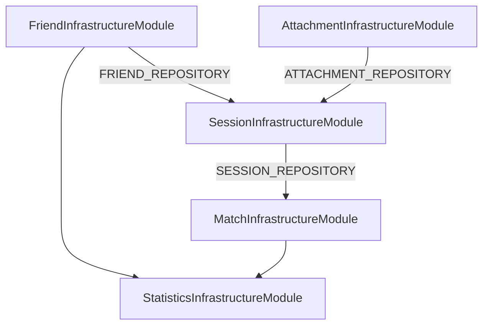

# 인프라 계층 구현 계획

## 결정사항 요약

- **Python extract.py**: stub 생성 (winnerSide: unknown 등 mock JSON 반환). 08 단계에서 실제 OCR로 교체
- **Graphile Worker**: 모듈 + addJob + task 3개 파일 골격 생성. task handler 로직은 08에서 구현

## 사전 준비

### 1. MikroORM config 보완

[mikro-orm.config.ts](apps/api/mikro-orm.config.ts)에 `Migrator` 확장 등록 (마이그레이션 수행에 필요):

```typescript
import { Migrator } from '@mikro-orm/migrations';
extensions: [Migrator],
```

### 2. 의존성 추가

```bash
yarn workspace @playnote/api add @aws-sdk/client-s3 graphile-worker execa
yarn workspace @playnote/api add -D @types/execa
```

---

## Step 1: ORM Entity 11개

경로: `{domain}/infrastructure/persistence/*.orm-entity.ts`

| Entity           | 파일                             | FK/Cascade                    |
| ---------------- | -------------------------------- | ----------------------------- |
| Friend           | friend.orm-entity.ts             | —                             |
| Session          | session.orm-entity.ts            | —                             |
| Attendance       | attendance.orm-entity.ts         | sessionId → ON DELETE CASCADE |
| TeamPresetMember | team-preset-member.orm-entity.ts | sessionId → ON DELETE CASCADE |
| Comment          | comment.orm-entity.ts            | sessionId → ON DELETE CASCADE |
| Match            | match.orm-entity.ts              | sessionId (참조)              |
| MatchTeamMember  | match-team-member.orm-entity.ts  | matchId → ON DELETE CASCADE   |
| Attachment       | attachment.orm-entity.ts         | sessionId, matchId INDEX      |
| ExtractionResult | extraction-result.orm-entity.ts  | attachmentId UNIQUE           |

**공통 규칙**:

- `@Entity({ tableName: 'snake_case' })`
- id: `@PrimaryKey()`, uuid type
- enum 필드: `@Enum()` 데코레이터
- UNIQUE: `@Unique()` 또는 `@Unique({ name: '...', properties: [...] })`
- Comment: createdAt만 (updatedAt 없음, 시스템디자인 4.4)
- ExtractionResult: createdAt만

**Session**: `@OneToMany` → Attendance, TeamPresetMember (cascade, orphanRemoval)
**Match**: `@OneToMany` → MatchTeamMember (cascade)

---

## Step 2: Repository 구현체 6개

### MikroFriendRepository

[friend/infrastructure/persistence/mikro-friend.repository.ts](apps/api/src/domains/friend/infrastructure/persistence/mikro-friend.repository.ts)

- `findById`, `findAllActive`, `findAll`, `save`, `delete`
- `toOrmEntity` / `toDomainEntity` 내부 매핑

### MikroSessionRepository

[session/infrastructure/persistence/mikro-session.repository.ts](apps/api/src/domains/session/infrastructure/persistence/mikro-session.repository.ts)

- `findById` — populate attendances, teamPresetMembers
- `findByToken` — `$or: [{ editorToken: token }, { adminToken: token }]`
- `findAll` — `em.findByCursor()` 사용. DATE_PROXIMITY/STATUS_PRIORITY는 orderBy 또는 raw SQL로 처리. PK(id) tie-breaker 필수
- ConnectionDto 반환: Cursor 객체를 `{ edges, pageInfo }` 형태로 변환
- libs/relay에 MikroOrmRelayAdapter가 없으면 Repository 내부에서 Cursor → ConnectionDto 변환 유틸 작성

### MikroCommentRepository

[session/infrastructure/persistence/mikro-comment.repository.ts](apps/api/src/domains/session/infrastructure/persistence/mikro-comment.repository.ts)

- 기본 CRUD

### MikroMatchRepository

[match/infrastructure/persistence/mikro-match.repository.ts](apps/api/src/domains/match/infrastructure/persistence/mikro-match.repository.ts)

- `findById` + populate teamMembers
- `getNextMatchNo`: `SELECT COALESCE(MAX(match_no), 0) + 1`

### MikroAttachmentRepository

[attachment/infrastructure/persistence/mikro-attachment.repository.ts](apps/api/src/domains/attachment/infrastructure/persistence/mikro-attachment.repository.ts)

- `countBySessionIdForUpdate`: `em.nativeUpdate` 또는 `qb.select().where().getCount()` + FOR UPDATE. 실제로는 `em.getConnection().execute('SELECT COUNT(*) ... FOR UPDATE')` 또는 `em.lock()` 활용

### MikroExtractionResultRepository

[attachment/infrastructure/persistence/mikro-extraction-result.repository.ts](apps/api/src/domains/attachment/infrastructure/persistence/mikro-extraction-result.repository.ts)

---

## Step 3: S3 서비스

[shared/infrastructure/storage/s3-storage.service.ts](apps/api/src/shared/infrastructure/storage/s3-storage.service.ts)

- `generatePresignedPutUrl(key, contentType, expiresIn?)`
- `deleteObject(key)`, `deleteObjects(keys[])`
- `getSignedUrl(key, expiresIn?)`
- ConfigModule에서 AWS_REGION, S3_BUCKET 주입

---

## Step 4: ACL 구현체

### FriendContextAcl (Session이 사용)

[session/infrastructure/acl/friend-context.acl.ts](apps/api/src/domains/session/infrastructure/acl/friend-context.acl.ts)

- `getActiveFriendIds(): Promise<string[]>` — FriendRepository.findAllActive() → map to ids
- Session InfrastructureModule에서 FriendInfrastructureModule import, FRIEND_REPOSITORY 주입

### AttachmentContextAcl (Session이 사용)

[session/infrastructure/acl/attachment-context.acl.ts](apps/api/src/domains/session/infrastructure/acl/attachment-context.acl.ts)

- `countBySessionId(sessionId): Promise<number>` — AttachmentRepository.countBySessionId()

### SessionContextAcl (Match가 사용)

[match/infrastructure/acl/session-context.acl.ts](apps/api/src/domains/match/infrastructure/acl/session-context.acl.ts)

- `getTeamPreset(sessionId): Promise<TeamPresetDto[]>` — SessionRepository.findById → teamPresetMembers → DTO 변환
- TeamPresetDto: `{ friendId, team, lane }`

### MatchStatsContextAcl, FriendStatsContextAcl (Statistics가 사용)

[statistics/infrastructure/acl/](apps/api/src/domains/statistics/infrastructure/acl/)

- Match: `getConfirmedMatchStats(input)` — em.createQueryBuilder 또는 raw query (match + match_team_member join, isConfirmed=true)
- Friend: `getActiveFriends(input)` — FriendRepository.findAll

ACL 인터페이스는 Application layer에 있으나, 구현체가 인터페이스를 구현하려면 해당 인터페이스가 필요. 04-application 미구현 시 임시로 infrastructure 내 로컬 interface 또는 application/acl/.interface.ts에 타입만 선언.

---

## Step 5: Graphile Worker

### 패키지 및 모듈

- `graphile-worker` 설치
- [shared/infrastructure/worker/graphile-worker.module.ts](apps/api/src/shared/infrastructure/worker/graphile-worker.module.ts)
- [shared/infrastructure/worker/graphile-worker.service.ts](apps/api/src/shared/infrastructure/worker/graphile-worker.service.ts)
  - `addJob(taskName, payload)`
  - OnModuleInit에서 `run({ connectionString, concurrency, taskDirectory, crontabFile })`

### Task 파일 골격

```
shared/infrastructure/worker/tasks/
├── lol_endscreen_extract.ts    # export default async (payload) => { ... }
├── cleanup_s3_objects.ts
└── auto_done_sessions.ts
```

crontab:

```
0 19 * * * auto_done_sessions
```

각 task: `// TODO: 08-worker-ocr에서 구현` 주석 + 빈 본문 또는 로그만.

---

## Step 6: IExtractionService 구현체 (Python CLI)

[attachment/infrastructure/extraction/python-cli-extraction.service.ts](apps/api/src/domains/attachment/infrastructure/extraction/python-cli-extraction.service.ts)

- `execute(input)` → `execa('python', ['scripts/ocr/extract.py', '--input', jsonStr])`
- stdout JSON 파싱 → ExtractionOutput

### scripts/ocr/extract.py (stub)

```python
#!/usr/bin/env python3
import json, sys
# --input으로 JSON 받아서
# { "winnerSide": "unknown", "teamASide": "unknown", "confidence": {}, "result": {} } 반환
```

---

## Step 7: InfrastructureModule 패턴

각 도메인별 `{domain}.infrastructure.module.ts`:

- FriendInfrastructureModule: MikroOrmModule.forFeature([FriendOrmEntity]), FRIEND_REPOSITORY
- SessionInfrastructureModule: Session + Attendance + TeamPresetMember + Comment entities, SESSION_REPOSITORY, COMMENT_REPOSITORY, ACL 2개 (FriendContextAcl, AttachmentContextAcl)
- MatchInfrastructureModule: Match + MatchTeamMember, MATCH_REPOSITORY, SessionContextAcl
- AttachmentInfrastructureModule: Attachment + ExtractionResult, IExtractionService 구현체 바인딩

---

## Step 8: 마이그레이션

1. 모든 ORM Entity 작성 완료 후 `yarn migration:generate` 실행
2. 초기 마이그레이션인 경우 `--initial` 플래그 확인
3. 생성된 SQL 검토 (FK, CASCADE, UNIQUE, INDEX)
4. PostgreSQL 기동 후 `yarn migration:up`

---

## 의존성 그래프



---

## 검증

- `yarn api build` 성공
- `yarn migration:generate` 성공
- Docker Postgres 기동 후 `yarn migration:up` 성공
- 테이블 11개 생성 확인
