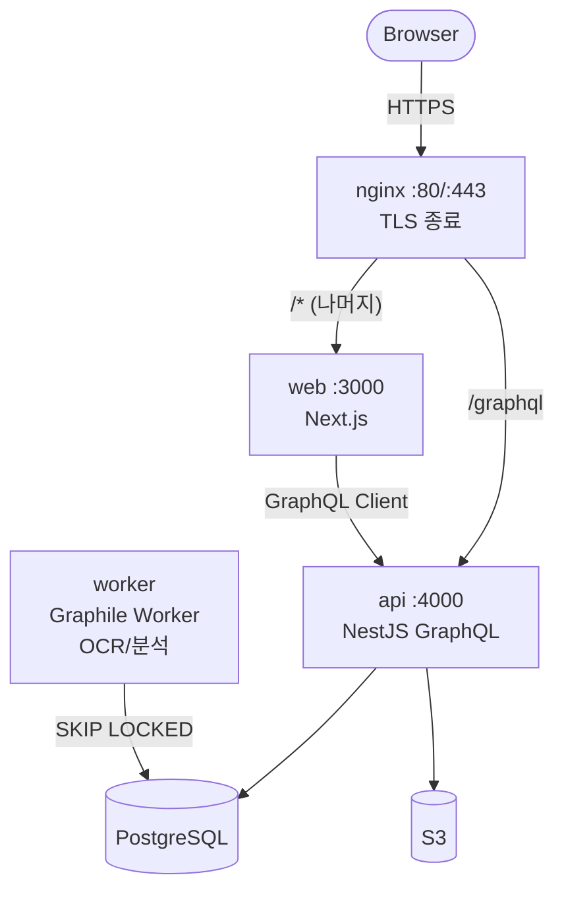
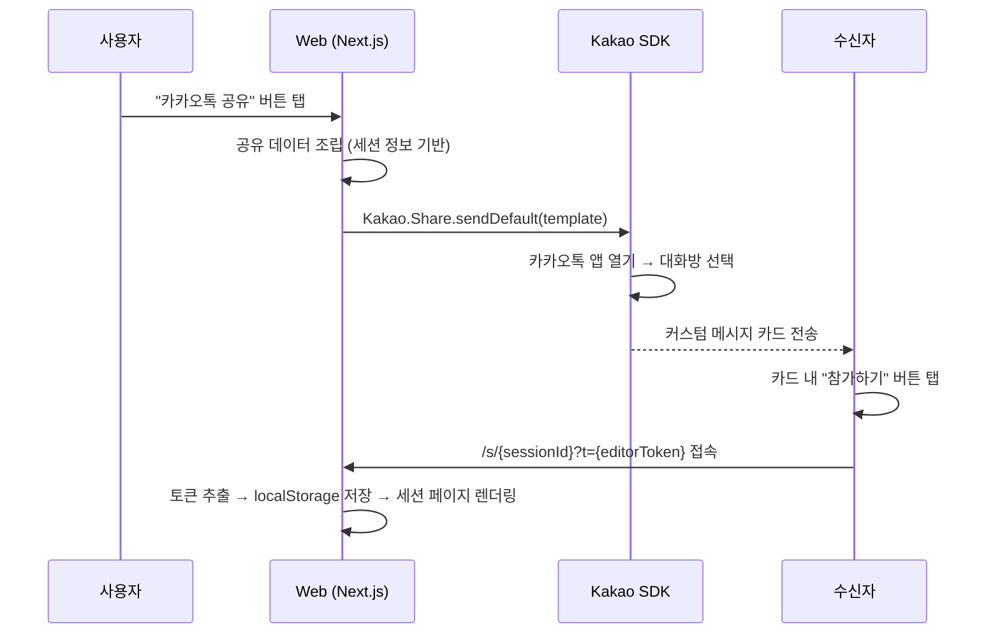
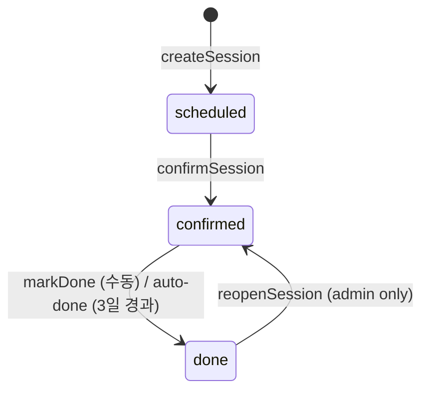
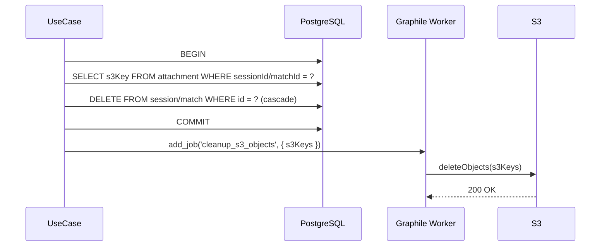
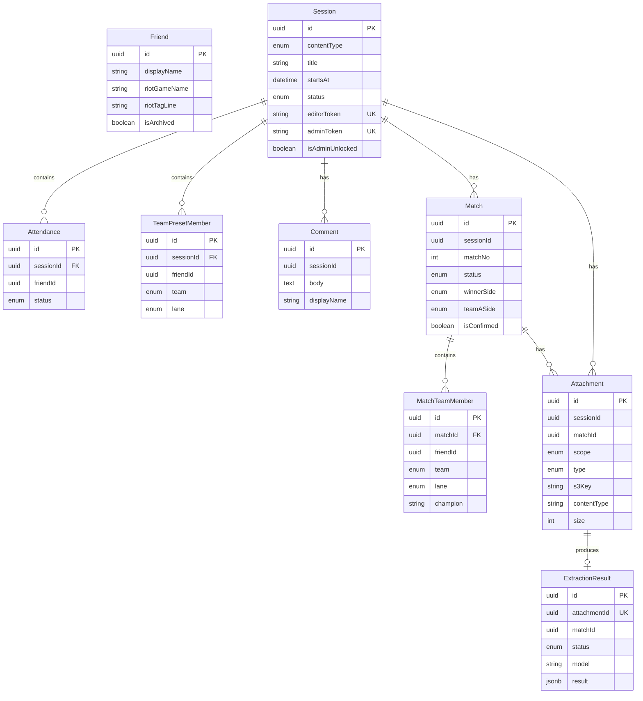
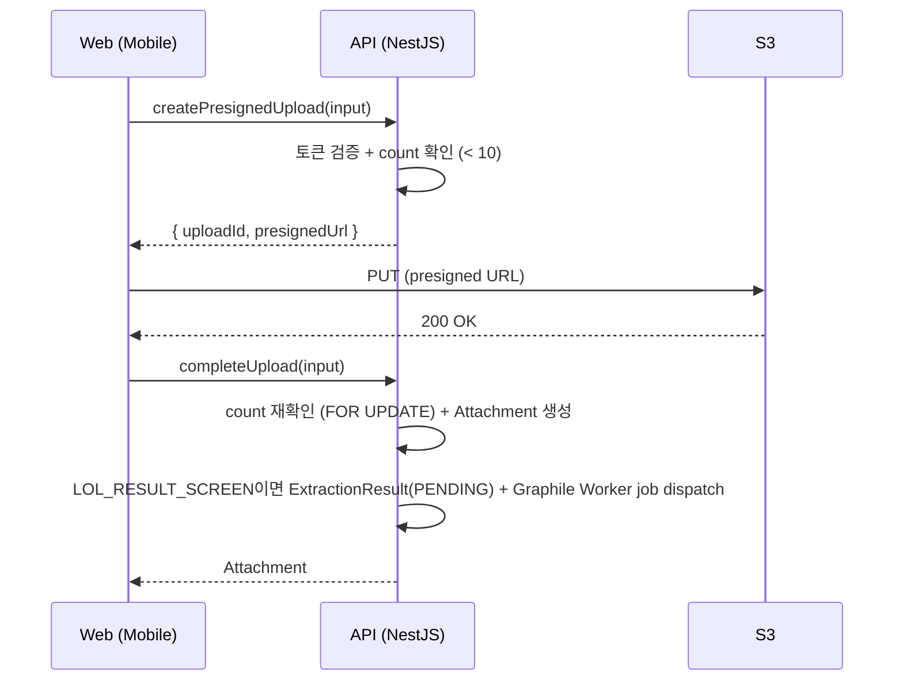
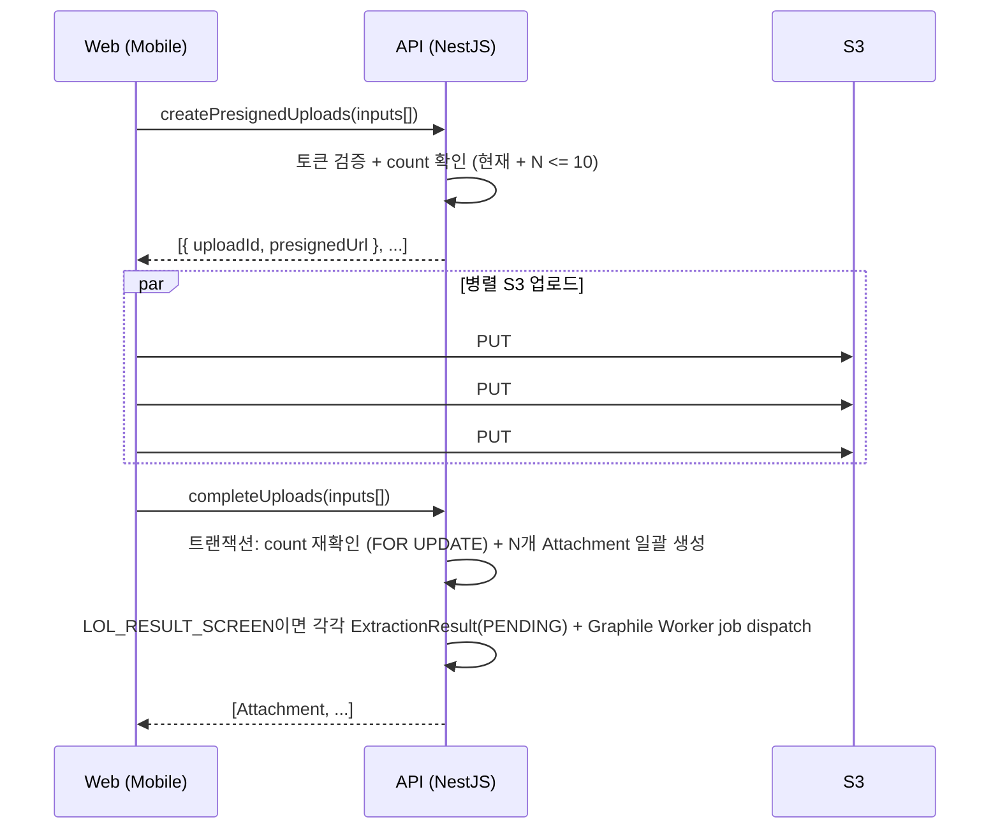

# PlayNote — System Design Spec (Concrete Draft v0.1)

> 이 문서는 “현재 확정된 스택(Next.js + NestJS GraphQL + PostgreSQL + MikroORM + S3 + EC2/Docker)”을 전제로, 구현 가능한 수준까지 시스템 설계를 구체화한 초안이다.  
> **아키텍처 최종 결정은 Cursor 설계 결과에 따라 변경 가능**하며, 변경 시 Decision Log에 기록한다.
>
> **문서 컨벤션**: 다이어그램은 **mermaid** 로 작성한다.

---

## 1) Goals / Non-Goals

### Goals

- 로그인 없이, **세션 링크(토큰)** 기반으로 모임을 운영한다.
- 세션(롤/풋살) 생성 → 셋업(참가/팀/라인) → 기록(매치/첨부/댓글) 3-Screen 흐름 제공
- 롤은 세션 내 **Match 1..N** 지원 + 결과창 스샷 기반으로 승/패/진영 확정
- 확정된 Match만 대상으로 **승률/선호 라인/자주 이긴 챔피언 통계** 제공
- **댓글은 텍스트 전용**, 이미지는 별도 **Attachment(첨부)** 로 관리
- 세션당 첨부 이미지 총합 **최대 10장**
- 단톡방 1개 고정 → Friend는 **서비스 전역 단일 주소록**

### Non-Goals (MVP 범위 밖)

- 사용자 계정/로그인/프로필
- 여러 단톡방/그룹/멀티테넌시
- 롤 결과창 외의 스샷 포맷 지원
- 챔피언/라인 자동 추출 “필수화” (champion은 수동 입력 허용)
- 실시간 협업(OT, presence) 수준의 동시편집

### 컨텐츠별 기능 범위 (확정)

| 기능                     | LoL             | 풋살          |
| ------------------------ | --------------- | ------------- |
| 세션 생성/상태 관리      | O               | O             |
| 참가(Attendance)         | O               | O             |
| 셋업 확정 (참가/팀/라인) | O               | O             |
| 팀 나누기 (A/B)          | O               | O             |
| Match 1..N               | O               | **X**         |
| 라인/챔피언              | O               | **X**         |
| 첨부(사진 기록)          | O (결과창 스샷) | O (세션 사진) |
| OCR 자동 추출            | O               | **X**         |
| 통계                     | O               | **X**         |
| 댓글                     | O               | O             |

> **풋살 세션 = 팀 + 첨부(사진 기록) + 댓글만. Match/OCR/통계는 LoL 전용.**

---

## 2) High-Level Architecture

### 2.1 서비스 경계 / 컴포넌트 (확정)

- **Web (Next.js)** — 순수 프론트엔드
  - UI 렌더링 + 라우팅
  - GraphQL Client (API 서버와 통신)
  - 세션 토큰 저장/전송
  - S3 presigned URL로 직접 업로드 수행
  - BFF 없음: 서버 사이드 비즈니스 로직을 두지 않음
- **API (NestJS GraphQL)** — 모든 비즈니스 로직
  - DDD 4계층 구조 (Domain / Application / Infrastructure / Presentation)
  - GraphQL endpoint (Query / Mutation)
  - 토큰 검증 + AuthContext 주입 (Guard)
  - UseCase(Command/Query) 실행
  - S3 presigned URL 발급 + 첨부 제한(10장) 강제
  - OCR Job 생성(pending 상태로만 생성, 실행은 worker)
- **Worker** — OCR/분석 전용 (확정, **Graphile Worker**)
  - **Graphile Worker**: PostgreSQL 기반 job queue (SKIP LOCKED, 재시도, 중복 방지 내장)
  - Redis 불필요 — PostgreSQL만으로 job 관리 완결
  - 초기: Graphile Worker task에서 Python CLI 호출 (선택지 A)
  - 향후: 별도 Python 서비스로 교체 가능 (선택지 B)
  - **확장성 설계**: Domain에 `IExtractionService` 인터페이스 → Infrastructure에서 구현체 교체 (DIP)
  - Application/Domain 코드 변경 없이 InfrastructureModule DI 바인딩만 교체하면 B로 전환 가능
- **PostgreSQL + MikroORM**
- **S3** — 첨부 파일 저장소
- **EC2 + Docker** — 컨테이너로 배포/운영

### 2.2 Deployment Topology (Single EC2 + Docker Compose)



- nginx: 80/443, TLS 종료 + 라우팅
- web (Next.js): :3000
- api (NestJS): :4000
- worker (Graphile Worker): 외부 요청 없음, PostgreSQL SKIP LOCKED 기반 job 처리
- postgres: 초기엔 docker, 안정화 시 RDS 고려
- Redis 불필요 (Graphile Worker가 PostgreSQL만으로 job queue 제공)

### 2.3 글로벌 네비게이션 (확정)

- **하단 탭 바 (Bottom Tab Bar)**: 모바일 우선 앱에서 주요 기능 접근 제공
- 3탭 구성:
  - **Sessions** (calendar 아이콘): 세션 목록 홈 — 세션 카드 → 세션 상세 진입
  - **Statistics** (chart-column 아이콘): 통계 개요(Stats Overview) — Friend 행 탭 → 상세 통계(Stats Detail)
  - **Friends** (users 아이콘): 친구 관리 — admin only CRUD, editor도 목록 조회 가능
- 활성 탭: `$primary` (#2563EB) + fontWeight 600, 비활성 탭: `$gray-400` + fontWeight 500
- 세션 상세, 매치 상세 등 하위 페이지에서는 탭 바를 숨기고 뒤로가기 화살표로 복귀

### 2.4 GraphQL 설계 (확정)

- **Code-First** 방식 (NestJS `@ObjectType`/`@InputType`/`@Field` 데코레이터, `autoSchemaFile` 자동 스키마 생성)
- **Relay 스펙 준수**: Global Object Identification, Input Object Mutations, Cursor Connections
- **GraphQL Client**: Apollo Client
- **Mutation 네이밍**: `{동사}{대상}` 형식, 비즈니스 의도 반영 (예: `confirmSession`, `createMatchFromPreset`)
- **에러 처리**: Exception 기반 (`BaseException` 상속), `errors[].extensions.code`로 에러 코드 전달
- **주 사용 환경**: 스마트폰 (카카오톡 링크 → 모바일 브라우저)

> 상세 규칙은 `NEW_DEVELOPMENT_GUIDE.md` 7절(프레젠테이션 계층), 11절(에러 처리) 참조

---

## 3) Authentication & Authorization (Token-based, 확정)

### Token Model

- Session 단위로 토큰 2개:
  - **editorToken**: 링크 가진 사람 (CRUD 대부분 가능)
  - **adminToken**: 운영 기능 가능 (unlock, token rotate 등)

### Token Transport (헤더 방식, 확정)

- 링크 진입: `/s/{sessionId}?t={token}` (카카오톡에서 공유)
- Web이 토큰을 localStorage에 저장:
  - key: `playnote:session:{sessionId}:token`
  - 세션별로 독립 저장 → 다중 세션 토큰 지원
  - 최근 사용 시각 key: `playnote:session:{sessionId}:last-used-at`
- 이후 GraphQL 요청 시 **헤더**로 전송:
  - `x-session-id: <sessionId>`
  - `x-session-token: <token>`
- Apollo Client의 httpLink에서 헤더 자동 주입
- 활성 세션 선택 규칙(Phase 07):
  - key: `playnote:active-session-id`
  - 헤더 주입 시 우선순위: 요청 variables의 `sessionId` → 현재 `/s/{id}` 경로 → active session
  - active session이 없으면 저장된 토큰 중 `last-used-at` 최신 세션을 기본 컨텍스트로 선택
  - 다중 세션 토큰을 보관하되 기본 컨텍스트는 active session으로 결정

> 쿠키 대신 헤더를 선택한 이유: 로그인 없는 세션별 토큰 모델에서 다중 세션 지원이 자연스럽고, CSRF 보호가 불필요하며, 모바일 브라우저 호환성이 우수함.

### Authorization Rules (MVP, 확정)

- **editor** (editorToken):
  - 세션/참여/팀/매치/댓글/첨부 **생성·수정** 가능
  - 첨부/댓글 **개별 삭제** 가능
  - 세션/매치 삭제는 **불가**
- **admin** (adminToken):
  - editor 권한 전부 포함
  - **세션 삭제**, **매치 삭제** (cascade 포함)
  - **unlock** (잠금 해제)
  - Friend CRUD (생성/수정/아카이브)

> 설계 철학: 단톡방 내부 운영 도구이므로 권한을 과도하게 복잡하게 만들지 않되, 파괴적 작업(세션/매치 삭제)은 admin으로 제한한다.

### Token Rotation (MVP 스킵)

- editorToken 회전: 단톡방 전체 링크가 무효화되므로 **사용하지 않음**
- adminToken 재발급: MVP에서 불필요. 필요 시 나중에 추가 (Session 테이블 토큰 컬럼 값 업데이트)

### Abuse Mitigation (확정)

- **nginx `limit_req`**: IP 기반 ~30r/s (가장 단순, NestJS 코드 변경 없음)
- 업로드 제한: 세션당 10장 (비즈니스 룰)
- admin token은 공유하지 않는 운영 가이드(문서)
- NestJS ThrottlerModule 등은 MVP 불필요

### 인증 구현 (확정)

- **Auth Reader 분리**: `SessionTokenGuard`는 `SessionTokenService`를 통해 `ISessionTokenReader`만 사용하고, Session Aggregate 전체 조회는 사용하지 않는다.
- **최소 필드 조회**: `session` 테이블에서 `id/editorToken/adminToken`만 조회해 토큰을 검증한다.
- **에러코드 분리**:
  - 세션 없음 → `SESSION_NOT_FOUND`
  - 토큰 불일치 → `INVALID_TOKEN`
  - admin 권한 부족 → `FORBIDDEN`
  - 헤더 누락/비정상 컨텍스트 → `UNAUTHORIZED`
- **캐시 미도입**: MVP에서는 인메모리 캐시 없이 요청마다 DB 조회를 유지한다.
- **프론트 범위 제외**: Web 토큰 주입/파싱 고도화는 후속 단계에서 다룬다.

### Phase 07 추가 결정 (프론트 연동)

- 보호 API role probe를 위해 `authContext` Query를 추가한다.
  - 응답: `{ sessionId: Global ID, role: EDITOR | ADMIN }`
  - Friend CRUD / Match 삭제 UI 노출 조건으로 사용
- 공개 범위:
  - Query: `sessionPreview`만 공개
  - Mutation: `createSession`은 온보딩을 위해 공개 (`@Public`)
  - `/sessions`, `/stats`, `/friends`는 토큰 없는 경우 링크 유도 화면을 노출한다.
- 링크 진입 정책:
  - `/s/{sessionId}?t={token}` 진입 시 `token/share-token`을 최신값으로 저장(기존 값 덮어쓰기)
  - `INVALID_TOKEN | SESSION_NOT_FOUND | UNAUTHORIZED` 시 해당 세션의 저장 토큰과 active-session을 정리하고 재진입 안내를 노출한다.
  - Apollo errorLink에서도 위 인증 실패 코드를 공통 감지해 토큰 저장소를 정리한다.
- 생성 직후 공유 UX:
  - `/sessions/new` 성공 시 `/sessions/new/share-complete?sessionId={globalId}`로 이동
  - share-complete 화면에서 카카오 공유/링크 복사 후 `/s/{id}/setup`으로 이어진다.

---

## 3-A) 카카오톡 링크 공유 설계 (UC-1-2, 확정)

> 세션 링크를 카카오톡 단체 톡방에 공유하는 핵심 플로우.
> 프론트엔드(Next.js)에서 **Kakao JS SDK**를 사용하며, 백엔드 변경은 없다.

### 전제 조건

- **Kakao Developers** 앱 등록 + JavaScript 키 발급
- 앱 설정에서 **플랫폼 > Web > 사이트 도메인** 등록 (e.g. `https://playnote.app`)
- Kakao 공유 **커스텀 템플릿** 생성 (Kakao Developers 콘솔 > 메시지 템플릿)

### SDK 초기화 (Next.js)

- `Kakao.init(JAVASCRIPT_KEY)` — 앱 진입 시 1회 호출
- Next.js `_app.tsx` 또는 레이아웃에서 `<Script src="https://t1.kakaocdn.net/kakao_js_sdk/...">` 로드
- 환경 변수: `NEXT_PUBLIC_KAKAO_JS_KEY`

### 공유 플로우



### 공유 메시지 템플릿 (Feed 타입)

```typescript
Kakao.Share.sendDefault({
  objectType: "feed",
  content: {
    title: `${contentLabel} — ${formattedDate}`, // e.g. "롤 내전 — 2026.03.07 (토)"
    description: `${time} · 참가 ${attending}/${total}`, // e.g. "19:00 · 참가 3/10"
    imageUrl: thumbnailUrl, // 컨텐츠별 기본 이미지
    link: { mobileWebUrl: shareUrl, webUrl: shareUrl },
  },
  buttons: [
    {
      title: "참가하기",
      link: { mobileWebUrl: shareUrl, webUrl: shareUrl },
    },
  ],
});
```

- `shareUrl` = `{PUBLIC_BASE_URL}/s/{sessionId}?t={editorToken}`
- `thumbnailUrl` = 컨텐츠별 정적 이미지 (S3 또는 `/public` 디렉토리)
  - LoL: `{CDN}/images/og-lol.png`
  - 풋살: `{CDN}/images/og-futsal.png`

### 공유 데이터 조립 (프론트엔드)

공유 버튼 클릭 시, 이미 로드된 세션 데이터에서 조립한다 (추가 API 불필요):

| 필드          | 소스                                           |
| ------------- | ---------------------------------------------- |
| contentLabel  | `session.contentType` → "롤 내전" / "풋살"     |
| formattedDate | `session.startsAt` → "2026.03.07 (토)"         |
| time          | `session.startsAt` → "19:00"                   |
| attending     | `session.attendances`에서 `ATTENDING` 수 count |
| total         | `session.attendances` 전체 수                  |
| shareUrl      | 현재 페이지 URL (`/s/{sessionId}?t={token}`)   |

### OG 메타 태그 (링크 프리뷰)

카카오톡 외 플랫폼(iMessage, Slack 등)에서 링크 프리뷰를 위해 Next.js에서 서버 사이드로 OG 태그를 렌더링한다.

```
/s/{sessionId} 페이지:
  <meta property="og:title" content="{컨텐츠} — {날짜}" />
  <meta property="og:description" content="{시간} · PlayNote" />
  <meta property="og:image" content="{thumbnailUrl}" />
  <meta property="og:url" content="{shareUrl}" />
```

- OG 태그 렌더링 시에는 **토큰 없이** 세션 기본 정보만 필요
- **`sessionPreview(sessionId)` 공개 쿼리** 사용 (토큰 불필요, 섹션 11 Queries 참조)
  - 응답: `{ contentType, title, startsAt }` — 민감 정보 없음
  - Next.js `generateMetadata`에서 이 쿼리를 호출하여 OG 태그 조립
- editorToken은 OG 태그에 절대 노출하지 않음

### 폴백: 링크 복사

```
카카오톡 미설치 / SDK 로드 실패 시:
  1. "링크 복사" 버튼으로 전환 (또는 항상 병행 노출)
  2. navigator.clipboard.writeText(shareUrl)
  3. 토스트: "링크가 복사되었습니다"
```

- 공유 버튼 UI: **1순위 "카카오톡 공유"** + **2순위 "링크 복사"** 병렬 노출
- `Kakao.isInitialized()` 체크 후 SDK 미로드 시 카카오톡 버튼 비활성화

### 공유 버튼 노출 위치

| 화면                  | 위치             | 비고                  |
| --------------------- | ---------------- | --------------------- |
| 세션 생성 완료        | 완료 화면 CTA    | 최초 공유 유도        |
| 세션 셋업 (scheduled) | 상단 공유 아이콘 | 참가자 모집 중 재공유 |
| 세션 상세 (confirmed) | 상단 공유 아이콘 | 확정 후에도 공유 가능 |

### 제약 사항

- 카카오톡 공유는 **HTTPS** 환경에서만 동작 (로컬 개발 시 `localhost` 예외 등록 필요)
- 공유 메시지의 이미지 URL은 **공개 접근 가능**해야 함 (S3 public or CDN)
- Kakao SDK는 **브라우저 환경 전용** (SSR에서 호출 불가, `useEffect` 내에서 사용)

### 영향 범위

- **백엔드**: 변경 없음 (기존 세션 조회 API + 토큰 체계 그대로 사용)
- **프론트엔드**: Kakao JS SDK 통합 + 공유 버튼 컴포넌트 + OG 메타 태그
- **인프라**: Kakao Developers 앱 등록 + 환경 변수 1개 (`NEXT_PUBLIC_KAKAO_JS_KEY`)

---

## 4) Domain Model & State Machines

## 4.0 Aggregate / Bounded Context / 모듈 경계 (확정)

### Aggregate 설계

| Aggregate Root       | 내부 Entity                  | Value Object                        | 비고                              |
| -------------------- | ---------------------------- | ----------------------------------- | --------------------------------- |
| **Friend**           | —                            | RiotId, DisplayName                 | 전역 주소록, 단독                 |
| **Session**          | Attendance, TeamPresetMember | SessionStatus, SessionToken         | 세션 생명주기 + 참가/팀(+라인)    |
| **Comment**          | —                            | —                                   | 텍스트 전용, 단순 CRUD            |
| **Match**            | MatchTeamMember              | MatchStatus, Side, Lane, WinnerSide | LoL 매치 생명주기                 |
| **Attachment**       | —                            | AttachmentType, AttachmentScope     | 첨부 업로드/삭제                  |
| **ExtractionResult** | —                            | ExtractionStatus                    | OCR 추출 결과 저장 (shadow table) |

> Content(LOL/FUTSAL)는 별도 Entity가 아니라 **Session의 enum 속성**으로 처리

### Bounded Context / NestJS 모듈 (확정)

| 모듈             | Aggregate Root(s)            | Repository                                         | 책임                                                         |
| ---------------- | ---------------------------- | -------------------------------------------------- | ------------------------------------------------------------ |
| **`friend`**     | Friend                       | IFriendRepository                                  | 전역 주소록 CRUD + archive                                   |
| **`session`**    | Session, Comment             | ISessionRepository, ICommentRepository             | 세션 생명주기, 참가/팀(+라인), 댓글                          |
| **`match`**      | Match                        | IMatchRepository                                   | LoL 매치 생명주기, 라인/챔피언, 결과 확정                    |
| **`attachment`** | Attachment, ExtractionResult | IAttachmentRepository, IExtractionResultRepository | 첨부 업로드/삭제, S3 연동, OCR 결과 저장                     |
| **`statistics`** | (없음, 읽기 전용)            | —                                                  | 확정된 Match 기반 통계 쿼리 (ACL로 match/friend 데이터 조회) |

### Cross-Aggregate 연동 (UseCase 레벨)

| 시나리오                                  | 처리 방식                                                                                                |
| ----------------------------------------- | -------------------------------------------------------------------------------------------------------- |
| Session 생성 시 Attendance 자동 생성      | Session UseCase → Friend ACL로 active Friend 목록 조회 → Attendance bulk INSERT                          |
| Attendance 목록 정렬 (참여 빈도)          | Session UseCase → Attendance Repository에서 contentType별 ATTENDING 횟수 집계                            |
| Match 생성 시 TeamPreset 복사 (팀 + 라인) | Match UseCase → Session ACL로 TeamPreset(team, lane) 조회 → MatchTeamMember 생성                         |
| effectiveLocked 검사                      | Session UseCase → Attachment ACL로 count 조회                                                            |
| Attachment 업로드 시 10장 제한            | Attachment UseCase → 자체 Repository로 count 조회                                                        |
| OCR 추출 (Worker task)                    | Attachment UseCase → Match ACL로 MatchTeamMember 조회 + Friend ACL로 RiotID 조회 → Python CLI input 조립 |
| 통계 산출                                 | Statistics UseCase → Match/Friend ACL로 조회                                                             |

### 폴더 구조 (educore 패턴)

```
src/domains/
├── friend/
│   ├── domain/
│   │   ├── aggregates/friend.aggregate.ts
│   │   ├── value-objects/riot-id.vo.ts
│   │   ├── repositories/friend.repository.interface.ts
│   │   ├── exceptions/
│   │   └── constants.ts
│   ├── application/
│   ├── infrastructure/
│   ├── presentation/
│   └── friend.module.ts
├── session/
│   ├── domain/
│   │   ├── aggregates/session.aggregate.ts
│   │   ├── aggregates/comment.aggregate.ts
│   │   ├── entities/attendance.entity.ts
│   │   ├── entities/roster-member.entity.ts
│   │   ├── entities/team-preset-member.entity.ts
│   │   ├── enums/session-status.enum.ts
│   │   ├── enums/attendance-status.enum.ts
│   │   ├── enums/team.enum.ts
│   │   ├── enums/content-type.enum.ts
│   │   ├── value-objects/session-token.vo.ts
│   │   ├── repositories/session.repository.interface.ts
│   │   ├── repositories/comment.repository.interface.ts
│   │   └── constants.ts
│   ├── application/
│   ├── infrastructure/
│   ├── presentation/
│   └── session.module.ts
├── match/
│   ├── domain/
│   │   ├── aggregates/match.aggregate.ts
│   │   ├── entities/match-team-member.entity.ts
│   │   ├── enums/match-status.enum.ts
│   │   ├── enums/side.enum.ts
│   │   ├── enums/lane.enum.ts
│   │   ├── repositories/match.repository.interface.ts
│   │   └── constants.ts
│   ├── application/
│   ├── infrastructure/
│   ├── presentation/
│   └── match.module.ts
├── attachment/
│   ├── domain/
│   │   ├── aggregates/attachment.aggregate.ts
│   │   ├── aggregates/extraction-job.aggregate.ts
│   │   ├── enums/attachment-type.enum.ts
│   │   ├── enums/attachment-scope.enum.ts
│   │   ├── enums/extraction-status.enum.ts
│   │   ├── services/extraction.service.interface.ts  ← IExtractionService
│   │   ├── repositories/attachment.repository.interface.ts
│   │   ├── repositories/extraction-job.repository.interface.ts
│   │   └── constants.ts
│   ├── application/
│   ├── infrastructure/
│   │   ├── persistence/
│   │   └── extraction/
│   │       ├── python-cli-extraction.service.ts      ← 초기 구현체 (A)
│   │       └── http-extraction.service.ts            ← 향후 교체용 (B)
│   ├── presentation/
│   └── attachment.module.ts
└── statistics/
    ├── application/
    │   └── use-cases/queries/
    ├── presentation/
    └── statistics.module.ts
```

## 4.1 Core Entities (Conceptual)

- Friend (전역 주소록)
- Content (LOL / FUTSAL) — Session의 enum 속성
- Session (single startsAt)
- Attendance (Session 내부 Entity)
- TeamPresetMember (Session 내부 Entity, lane 포함)
- Match (LOL only, session 내 1..N)
- MatchTeamMember (Match 내부 Entity)
- Comment (text-only, session 모듈에 공존)
- Attachment (session or match scope)
- ExtractionResult (OCR 추출 결과, Graphile Worker shadow table)

## 4.2 Session State

- `scheduled` : 세션 생성됨, 셋업 화면에서 참가/팀/라인 설정 중
- `confirmed` : 셋업 확정 완료, 세션 상세 화면에서 매치/첨부/댓글 관리
- `done` : 운영상 마감 (수동 또는 자동 전환)

### Session 상태 전이 (확정)



| 전이                  | 뮤테이션         | 권한           | 조건                     |
| --------------------- | ---------------- | -------------- | ------------------------ |
| scheduled → confirmed | `confirmSession` | editor / admin | —                        |
| confirmed → done      | `markDone`       | editor / admin | —                        |
| confirmed → done      | (auto-done cron) | 시스템         | `startsAt < NOW() - 3일` |
| done → confirmed      | `reopenSession`  | **admin only** | —                        |

### 자동 Done 전환 (Auto-Done Cron, 확정)

`startsAt`으로부터 **3일 경과**한 `confirmed` 세션을 자동으로 `done`으로 전환한다.

- **구현**: Graphile Worker `cron` (기존 Worker 인프라 재활용, 추가 인프라 없음)
- **실행 주기**: 매일 1회 (e.g. 매일 04:00 KST)
- **대상**: `status = 'confirmed' AND startsAt < NOW() - INTERVAL '3 days'`

```sql
UPDATE session
SET status = 'done', updated_at = NOW()
WHERE status = 'confirmed'
  AND starts_at < NOW() - INTERVAL '3 days';
```

- **Observability**: 전환된 세션 수 로그 기록 (`logger.info('auto-done: transitioned N sessions')`)
- **`scheduled` 세션은 대상 아님**: 셋업 미완료 세션은 자동 마감하지 않음 (사용자가 직접 관리)
- **admin `reopenSession`으로 복구 가능**: 자동 마감 후에도 필요 시 다시 열 수 있음

### Session 생성 시 자동 처리 (확정)

1. Session row 생성
2. **모든 active Friend에 대해 Attendance row 자동 생성** (status: `UNDECIDED`)
   - `INSERT INTO attendance (sessionId, friendId, status) SELECT sessionId, id, 'UNDECIDED' FROM friend WHERE isArchived = false`
3. 즉, 세션 진입 시 전역 Friend 전체가 참가 관리 대상으로 노출됨

### Attendance 모델 (확정, 로그인 없는 대리 입력)

- **로그인이 없으므로 "나"라는 개념이 없음** → 모든 참가 상태 변경은 "Friend 목록에서 골라서 상태 설정"
- status enum: `UNDECIDED`(미정) / `ATTENDING`(참가) / `NOT_ATTENDING`(불참)
- Mutation: `setAttendance(sessionId, friendId, status)` — 기존 row의 status UPDATE만
- 누가 접속해서 바꾸든 동일한 동작 (editor 권한만 있으면 됨)

### Friend 목록 정렬 (참여 빈도 기반)

- Attendance 화면에서 **해당 contentType에 자주 참여한 Friend가 상단** 노출
- 정렬 기준: 과거 세션 중 동일 contentType에서 `status = ATTENDING`인 횟수 (내림차순)
- MVP: on-demand 쿼리 집계 (데이터 소량)

### Allowed Operations by Session Status

- scheduled (셋업 화면):
  - attendance 변경 가능
  - 팀 배정 / 라인 배정 가능
  - confirm (셋업 완료) 가능
- confirmed (세션 상세 화면):
  - 셋업 수정: **effectiveLocked=false** 일 때만 가능 (Attachment 0장)
  - match 생성/라인/챔피언 설정 가능
  - 첨부 업로드/댓글 작성 가능
  - match 결과 확정 가능

## 4.3 Locking Rule (확정)

### Lock Computation

- Session 테이블에 `isAdminUnlocked: boolean` (default: false) 컬럼
- `sessionAttachmentCount`: 세션에 속한 모든 Attachment 수 (SESSION + MATCH scope 합산)
- **`effectiveLocked = (sessionAttachmentCount > 0) && !isAdminUnlocked`**
- Attachment 전부 삭제하여 count = 0이 되면 **자동 해제** (공식에 의해 자연스럽게 동작)

### Locked State ACL (확정)

| 액션                                  | unlocked | locked | admin unlock 후 |
| ------------------------------------- | :------: | :----: | :-------------: |
| 셋업 수정 (참가/팀/라인)              |    O     | **X**  |        O        |
| MatchTeamMember 변경 (팀/라인/챔피언) |    O     | **X**  |        O        |
| Match 생성 (createMatchFromPreset)    |    O     | **X**  |        O        |
| 댓글 작성/삭제                        |    O     |   O    |        O        |
| 첨부 업로드                           |    O     |   O    |        O        |
| 첨부 삭제                             |    O     |   O    |        O        |
| Match 결과 확정 (confirmMatchResult)  |    O     |   O    |        O        |
| Session 상태 전이 (confirm/done)      |    O     |   O    |        O        |

> 원칙: **잠김은 "구조 변경"만 막고, "기록 추가"와 "결과 확정"은 항상 허용**

### Unlock Policy (확정)

- `adminUnlock(sessionId)`: `isAdminUnlocked = true`로 설정
- `adminRelock(sessionId)`: 선택 사항 (필요 시 제공, `isAdminUnlocked = false`)

---

## 4.3-A 삭제 정책 & Cascade 규칙 (확정)

> 삭제는 **admin 권한 전용**이며, **hard delete** 방식이다.
> 연관된 모든 자식 데이터를 cascade 삭제한다.

### 권한 규칙

| 대상             | editor | admin |
| ---------------- | :----: | :---: |
| 세션 삭제        | **X**  |   O   |
| 매치 삭제        | **X**  |   O   |
| 첨부 삭제 (개별) |   O    |   O   |
| 댓글 삭제 (개별) |   O    |   O   |

> 세션/매치 삭제는 파괴적 작업(cascade)이므로 admin만 허용.
> 첨부/댓글 개별 삭제는 기존대로 editor도 가능.

### 세션 삭제 Cascade

```
deleteSession(sessionId)  — admin only
│
├─ Attendance            → ON DELETE CASCADE
├─ TeamPresetMember      → ON DELETE CASCADE
├─ Comment               → ON DELETE CASCADE
├─ Match                 → ON DELETE CASCADE
│   ├─ MatchTeamMember   → ON DELETE CASCADE
│   └─ Attachment (MATCH scope)
│       └─ ExtractionResult → ON DELETE CASCADE
├─ Attachment (SESSION scope)
│   └─ ExtractionResult  → ON DELETE CASCADE
└─ S3 objects            → 비동기 삭제 (아래 참조)
```

- DB: `ON DELETE CASCADE` FK 제약으로 단일 DELETE 문에서 연쇄 삭제
- S3: 삭제 대상 Attachment의 `s3Key` 목록을 수집 후 **비동기로 S3 삭제** 수행
  - 트랜잭션 커밋 후 fire-and-forget (또는 Graphile Worker job)
  - S3 삭제 실패 시 사용자 플로우 차단하지 않음, 로그 기록 후 재시도 또는 수동 정리

### 매치 삭제 Cascade

```
deleteMatch(matchId)  — admin only, isConfirmed=false만 가능
│
├─ MatchTeamMember       → ON DELETE CASCADE
├─ Attachment (MATCH scope)
│   └─ ExtractionResult  → ON DELETE CASCADE
└─ S3 objects            → 비동기 삭제
```

- `isConfirmed = true`인 매치는 삭제 불가 (통계 무결성 보호)
- 매치 삭제 시 세션의 attachment count 감소 → `effectiveLocked` 재계산

### S3 파일 비동기 삭제 전략



- **트랜잭션 내에서**: s3Key 목록 수집 + DB cascade 삭제
- **트랜잭션 후**: Graphile Worker에 S3 정리 job dispatch
- **실패 처리**: Worker retry로 재시도. 최종 실패 시 로그 기록 (orphan file은 주기적 정리 or 무시)

### Hard Delete 정책

- 세션/매치 삭제는 **hard delete** (soft delete 불사용)
- 이유: 로그인 없는 단톡방 도구로 데이터 복구 요구사항이 낮고, 구조 단순화 우선
- Friend만 soft delete(archive) — 통계/기록 연결이 있으므로

---

## 4.4 Data Model (확정)

### ERD



### Entity 필드 상세

**Friend**

| 필드         | 타입     | 제약          | 비고                           |
| ------------ | -------- | ------------- | ------------------------------ |
| id           | UUID v7  | PK            |                                |
| displayName  | string   | NOT NULL      | 그룹에서 부르는 이름           |
| riotGameName | string   | nullable      | Riot ID (gameName), OCR 매칭용 |
| riotTagLine  | string   | nullable      | Riot ID (tagLine), OCR 매칭용  |
| isArchived   | boolean  | default false | 삭제 대신 아카이브             |
| createdAt    | DateTime | NOT NULL      |                                |
| updatedAt    | DateTime | NOT NULL      |                                |

**Session**

| 필드            | 타입     | 제약                        | 비고                                         |
| --------------- | -------- | --------------------------- | -------------------------------------------- |
| id              | UUID v7  | PK                          |                                              |
| contentType     | enum     | NOT NULL                    | LOL / FUTSAL                                 |
| title           | string   | nullable                    | 선택적 제목                                  |
| startsAt        | DateTime | NOT NULL                    | 세션 날짜/시간                               |
| status          | enum     | NOT NULL, default SCHEDULED | SCHEDULED / CONFIRMED / ROSTER_LOCKED / DONE |
| editorToken     | string   | NOT NULL, UNIQUE            | 링크 공유용                                  |
| adminToken      | string   | NOT NULL, UNIQUE            | 운영자용                                     |
| isAdminUnlocked | boolean  | default false               | 잠금 해제 플래그                             |
| createdAt       | DateTime | NOT NULL                    |                                              |
| updatedAt       | DateTime | NOT NULL                    |                                              |

**Attendance** (Session 내부)

| 필드      | 타입     | 제약                        | 비고             |
| --------- | -------- | --------------------------- | ---------------- |
| id        | UUID v7  | PK                          |                  |
| sessionId | UUID     | NOT NULL, FK                |                  |
| friendId  | UUID     | NOT NULL                    |                  |
| status    | enum     | NOT NULL                    | YES / NO / MAYBE |
| createdAt | DateTime | NOT NULL                    |                  |
| updatedAt | DateTime | NOT NULL                    |                  |
|           |          | UNIQUE(sessionId, friendId) |                  |

**TeamPresetMember** (Session 내부, Roster 겸용)

| 필드      | 타입     | 제약                        | 비고                                                              |
| --------- | -------- | --------------------------- | ----------------------------------------------------------------- |
| id        | UUID v7  | PK                          |                                                                   |
| sessionId | UUID     | NOT NULL, FK                |                                                                   |
| friendId  | UUID     | NOT NULL                    |                                                                   |
| team      | enum     | NOT NULL                    | A / B                                                             |
| lane      | enum     | NOT NULL, default UNKNOWN   | TOP / JG / MID / ADC / SUP / UNKNOWN (LoL만 사용, 풋살은 UNKNOWN) |
| createdAt | DateTime | NOT NULL                    |                                                                   |
| updatedAt | DateTime | NOT NULL                    |                                                                   |
|           |          | UNIQUE(sessionId, friendId) |                                                                   |

> RosterMember 테이블 제거됨. 로스터 = TeamPresetMember에 할당된 멤버 (팀 배정 = 로스터 확정)

**Comment**

| 필드        | 타입     | 제약             | 비고              |
| ----------- | -------- | ---------------- | ----------------- |
| id          | UUID v7  | PK               |                   |
| sessionId   | UUID     | NOT NULL         | Session ID 참조   |
| body        | text     | NOT NULL         |                   |
| displayName | string   | nullable         | 익명 or 이름 선택 |
| createdAt   | DateTime | NOT NULL         |                   |
|             |          | INDEX(sessionId) |                   |

**Match**

| 필드        | 타입     | 제약                       | 비고                              |
| ----------- | -------- | -------------------------- | --------------------------------- |
| id          | UUID v7  | PK                         |                                   |
| sessionId   | UUID     | NOT NULL                   | Session ID 참조                   |
| matchNo     | integer  | NOT NULL                   | 세션 내 순번 (1-based)            |
| status      | enum     | NOT NULL, default DRAFT    | DRAFT / LINEUP_LOCKED / COMPLETED |
| winnerSide  | enum     | NOT NULL, default UNKNOWN  | BLUE / RED / UNKNOWN              |
| teamASide   | enum     | NOT NULL, default UNKNOWN  | BLUE / RED / UNKNOWN              |
| isConfirmed | boolean  | default false              | 통계 반영 여부                    |
| createdAt   | DateTime | NOT NULL                   |                                   |
| updatedAt   | DateTime | NOT NULL                   |                                   |
|             |          | UNIQUE(sessionId, matchNo) |                                   |

**MatchTeamMember** (Match 내부)

| 필드      | 타입     | 제약                      | 비고                                 |
| --------- | -------- | ------------------------- | ------------------------------------ |
| id        | UUID v7  | PK                        |                                      |
| matchId   | UUID     | NOT NULL, FK              |                                      |
| friendId  | UUID     | NOT NULL                  |                                      |
| team      | enum     | NOT NULL                  | A / B                                |
| lane      | enum     | NOT NULL, default UNKNOWN | TOP / JG / MID / ADC / SUP / UNKNOWN |
| champion  | string   | nullable                  | 수동 입력                            |
| createdAt | DateTime | NOT NULL                  |                                      |
| updatedAt | DateTime | NOT NULL                  |                                      |
|           |          | UNIQUE(matchId, friendId) |                                      |

**Attachment**

| 필드             | 타입     | 제약             | 비고                             |
| ---------------- | -------- | ---------------- | -------------------------------- |
| id               | UUID v7  | PK               |                                  |
| sessionId        | UUID     | NOT NULL         | Session ID 참조                  |
| matchId          | UUID     | nullable         | Match ID (SESSION scope면 null)  |
| scope            | enum     | NOT NULL         | SESSION / MATCH                  |
| type             | enum     | NOT NULL         | FUTSAL_PHOTO / LOL_RESULT_SCREEN |
| s3Key            | string   | NOT NULL         | S3 객체 키                       |
| contentType      | string   | NOT NULL         | MIME type                        |
| size             | integer  | NOT NULL         | bytes                            |
| width            | integer  | nullable         |                                  |
| height           | integer  | nullable         |                                  |
| originalFileName | string   | nullable         |                                  |
| createdAt        | DateTime | NOT NULL         |                                  |
|                  |          | INDEX(sessionId) | count 쿼리 + 목록 조회           |

**ExtractionResult** (Graphile Worker shadow table)

| 필드         | 타입     | 제약                      | 비고                                                              |
| ------------ | -------- | ------------------------- | ----------------------------------------------------------------- |
| id           | UUID v7  | PK                        |                                                                   |
| attachmentId | UUID     | NOT NULL, UNIQUE          | 1 attachment = 1 result                                           |
| matchId      | UUID     | NOT NULL                  | Match ID 참조                                                     |
| status       | enum     | NOT NULL, default PENDING | **PENDING / DONE / FAILED** (RUNNING 제거 — Graphile Worker 영역) |
| model        | string   | nullable                  | 추출 모델 버전 (done 시 기록, e.g. "paddleocr-v1")                |
| result       | jsonb    | nullable                  | done 시 채워짐 (상세 스키마는 `ocr_스팩.md` 5.3 output json 참조) |
| createdAt    | DateTime | NOT NULL                  | job dispatch 시점                                                 |

> - PENDING: `completeUpload` 시 행 INSERT + Graphile Worker에 job dispatch
> - DONE: task 성공 시 UPDATE (result, model 채움)
> - FAILED: task 최종 실패 시 UPDATE
> - `errorMessage`, `startedAt`, `completedAt`, `updatedAt` 제거 — Graphile Worker가 관리하거나 MVP 불필요
> - UI 상태: PENDING → "분석 중", DONE → 결과 표시, FAILED → "자동 추출 실패 (수동 확정 가능)"

### 세션당 10장 제한 강제 방식

1. **Presign 단계**: UseCase에서 `SELECT COUNT(*) FROM attachment WHERE sessionId = ?` 확인
2. **Complete 단계**: 트랜잭션 내에서 재확인 — `COUNT(*) ... FOR UPDATE` + count >= 10이면 reject
3. **동시성**: FOR UPDATE + 트랜잭션으로 race condition 방지

### 통계 산출에 필요한 최소 필드 (이미 포함 확인)

| 지표             | 사용 필드                                                                   |
| ---------------- | --------------------------------------------------------------------------- |
| Friend 승률      | MatchTeamMember(friendId, team) + Match(winnerSide, teamASide, isConfirmed) |
| 선호 라인        | MatchTeamMember(friendId, lane)                                             |
| 자주 이긴 챔피언 | MatchTeamMember(friendId, champion, team) + Match(winnerSide, teamASide)    |

> 승/패 계산: `teamAWon = (winnerSide === teamASide)`, `memberWon = (member.team === A && teamAWon) || (member.team === B && !teamAWon)`

---

## 5) Attachment & S3 Upload Design (확정)

### Constraints

- 세션당 첨부 총합 <= **10**
- 댓글에 이미지 첨부 불가
- 첨부는 2종:
  - FUTSAL_PHOTO (session scope)
  - LOL_RESULT_SCREEN (match scope)
- **다중 업로드 지원** (모바일 갤러리 다중 선택 대응)
- **UX 구분**: LOL_RESULT_SCREEN은 각 Match 카드 내부 "End Screen" 영역에서 업로드/표시, 일반 사진은 세션 레벨 Photos 섹션

### Upload 방식: Presigned PUT (확정)

Presigned PUT을 사용한다 (POST보다 단순, 단일 파일 업로드에 적합).

### Upload Flow (단건 + 배치)

**단건 API** (1장 업로드)



**배치 API** (N장 동시 업로드, 추천)



**배치 API Input/Output:**

- `createPresignedUploads(input)`:
  - input: `{ sessionId, files: [{ scope, matchId?, type, contentType, fileName? }] }`
  - output: `{ uploads: [{ uploadId, presignedUrl }] }`
  - 검증: `현재 count + files.length <= 10`
- `completeUploads(input)`:
  - input: `{ sessionId, uploads: [{ uploadId, s3Key, size, contentType, width?, height? }] }`
  - output: `{ attachments: [Attachment] }`
  - 트랜잭션: count 재확인 (FOR UPDATE) → N개 Attachment INSERT → ExtractionResult(PENDING) + Graphile Worker job dispatch

### Presigned URL S3 Key 규칙

```
attachments/{sessionId}/{uploadId}.{ext}
```

### Delete Attachment

- GraphQL `deleteAttachment(id)` (단건)
- API:
  - 권한(editor/admin) 확인
  - DB row delete + S3 object delete(비동기 가능)
  - count 감소 → 0이면 effectiveLocked 자동 해제 (공식에 의해)

### CDN / 이미지 리사이즈

- **MVP: 스킵**. S3 직접 URL로 서빙
- 성능 문제 시 CloudFront CDN 추가 가능

---

## 6) LoL Match Model (Session contains Match 1..N)

### Key Requirements

- 세션에서 만든 Team A/B 프리셋을 match 생성 시 복사
- match마다 blue/red 진영이 바뀜
- 진영/승패 관련 값은 **결과창 스샷** 기준으로 확정

### Team vs Side Separation

- Team A/B: 사람팀 (preset 및 match lineup)
- Side blue/red: 게임 진영
- Match fields:
  - `winnerSide`: blue|red|unknown
  - `teamASide`: blue|red|unknown (A가 어떤 진영인지)
- 승/패 계산:
  - teamASide + winnerSide로 Team A/B 승패 도출 가능

### Match Lifecycle

- `draft` : 생성됨, 라인/챔피언 입력 전
- `lineup_locked` : (선택) “이 판 라인 확정” 같은 운영 플래그
- `completed` : 결과 확정됨
- `isConfirmed` : 통계 반영 여부 (결과 확정 시 true)

### Match Creation (from preset)

- Mutation: `createMatchFromPreset(sessionId)`
  - new matchNo = max+1
  - SessionTeamPreset(A/B) 복사 → MatchTeamMember 생성
  - winnerSide/teamASide = unknown 초기화

### Lane Selection

- **기본 라인**: 세션 셋업 화면에서 TeamPresetMember.lane으로 배정
- **매치 라인**: Match 생성 시 TeamPresetMember.lane 복사 → MatchTeamMember.lane (매치별 변경 가능)
- lane enum: TOP/JG/MID/ADC/SUP/UNKNOWN
- **라인 표시 정렬**: TOP → JG → MID → ADC → SUP 순서 고정 (UI 리스트, 라인업 표시, 통계 등 모든 화면에서 동일)
- confirmed + effectiveLocked=false 상태에서 셋업 수정 허용

### Champion Input

- 수동 입력 허용
- 최소: string 저장 (나중에 championId 매핑 가능)

---

## 7) OCR / Extraction Pipeline (확정)

### Input Constraints

- 롤 첨부는 **게임 종료 결과창 1종**만 지원
- 업로드 파일 type: LOL_RESULT_SCREEN

### ExtractionResult + Graphile Worker (4.4 ExtractionResult 테이블 참조)

- **ExtractionResult**: shadow table (PENDING / DONE / FAILED), 추출 결과 저장
- **Graphile Worker**: job dispatch/실행/재시도/락 담당 (성공 시 job 자동 삭제)
- `result` jsonb: `{ winnerSide, teamASide, confidence, ocr, parsed, matching, teamASideEvidence, unmatched }` (상세: `ocr_스팩.md` 5.3)
- **재시도**: Graphile Worker 내장 retry 사용 (최종 실패 시 ExtractionResult.status → FAILED)

### Execution

- `completeUpload`(또는 `completeUploads`)에서 LOL_RESULT_SCREEN이면 **Graphile Worker에 job 등록** (`graphile_worker.add_job('lol_endscreen_extract', payload)`)
- Graphile Worker가 SKIP LOCKED로 job pick → `IExtractionService.execute()` 호출 → 결과 DB 저장 (DONE/FAILED)

### Confirm UX & Source of Truth (확정)

- 자동 추출 결과는 **"초안"** (참고용)
- 최종 확정은 Mutation `confirmMatchResult(matchId, input)`
  - input: `{ winnerSide, teamASide }` (+ optional sourceAttachmentId)
- confirm 시:
  - Match.winnerSide / Match.teamASide 업데이트
  - Match.isConfirmed = true
  - Match.status = COMPLETED
- **추출 성공/실패와 무관하게 수동 확정은 항상 가능**

> 자동 추출이 실패해도 수동 확정 가능해야 하며, 집계는 isConfirmed=true만 사용한다.

---

## 8) Comments — 4.4 Comment 테이블 참조, 변경 없음

---

## 9) Friend — 4.4 Friend 테이블 참조 (확정)

### 초기 데이터

- **`init.sql`로 Friend 데이터 사전 등록** (서비스 시작 시 단톡방 멤버 목록)
- 이후 admin이 Friend CRUD 수행 (추가/수정/아카이브)

### 관리 권한

- Friend CRUD는 **admin만 가능** (`createFriend`, `updateFriend`, `archiveFriend`)
- 조회(목록/상세)는 editor도 가능

### OCR Matching Strategy

- OCR에서 소환사 이름을 읽을 수 있다면 Friend.riotGameName/riotTagLine으로 매핑 시도
- 매칭 실패 시 UI에서 수동 매핑

---

## 10) Statistics (확정)

### Scope

- 확정된 LoL Match (`Match.isConfirmed = true`)만 사용
- 아카이브된 Friend는 기본 비노출 (includeArchived 옵션으로 포함 가능)

### 10-A. Stats Overview (전체 친구 요약)

모든 active Friend에 대해 요약 통계를 한 화면에 표시한다.

| 지표                     | 산출 방식                                              |
| ------------------------ | ------------------------------------------------------ |
| **승률 (WR)**            | `wins / totalMatches * 100` (소수점 없이 반올림)       |
| **전적 (W-L)**           | `{wins}-{losses}`                                      |
| **최다 라인 (Top Lane)** | `MODE(MatchTeamMember.lane)` — 가장 많이 플레이한 라인 |

**정렬**: 승률 내림차순 → 판수 많은 순 → displayName ASC

**매치 기록 없는 Friend**: 목록에 포함하되 WR `–`, W-L `0-0`, Lane `–` 표시

### 10-B. Stats Detail (친구별 상세)

특정 Friend의 상세 통계를 표시한다.

**요약 카드**

| 지표          | 산출 방식                               |
| ------------- | --------------------------------------- |
| Win Rate      | `wins / totalMatches * 100`             |
| Total Matches | 해당 Friend가 참여한 confirmed Match 수 |
| Top Lane      | 최다 플레이 라인                        |

**라인 분포 (Lane Distribution)**

- 라인별 플레이 횟수를 가로 바 차트로 표시
- 고정 순서: TOP → JG → MID → ADC → SUP
- UNKNOWN 라인은 집계에서 제외

```sql
-- 라인 분포 쿼리 예시
SELECT mtm.lane, COUNT(*) AS play_count
FROM match_team_member mtm
JOIN match m ON mtm.match_id = m.id
WHERE mtm.friend_id = :friendId
  AND m.is_confirmed = true
  AND mtm.lane != 'UNKNOWN'
GROUP BY mtm.lane
ORDER BY ARRAY_POSITION(ARRAY['TOP','JG','MID','ADC','SUP'], mtm.lane::text)
```

**자주 이긴 챔피언 (Most Winning Champions)**

| 컬럼     | 산출                                   |
| -------- | -------------------------------------- |
| Champion | `MatchTeamMember.champion` (null 제외) |
| Wins     | 해당 챔피언으로 이긴 횟수              |
| Games    | 해당 챔피언으로 플레이한 횟수          |
| Win Rate | `wins / games * 100`                   |

- 정렬: 승수 내림차순 → 승률 내림차순
- 상위 5개만 표시 (MVP)

```sql
-- 자주 이긴 챔피언 쿼리 예시
SELECT
  mtm.champion,
  COUNT(*) AS games,
  SUM(CASE WHEN (
    (mtm.team = 'A' AND m.winner_side = m.team_a_side) OR
    (mtm.team = 'B' AND m.winner_side != m.team_a_side)
  ) THEN 1 ELSE 0 END) AS wins
FROM match_team_member mtm
JOIN match m ON mtm.match_id = m.id
WHERE mtm.friend_id = :friendId
  AND m.is_confirmed = true
  AND mtm.champion IS NOT NULL
GROUP BY mtm.champion
ORDER BY wins DESC, (SUM(...)::float / COUNT(*)) DESC
LIMIT 5
```

### Query Strategy (MVP, 확정)

- **on-demand SQL 쿼리 집계** (GROUP BY). 데이터 양이 적음 (친구 ~20명, 매치 ~수십)
- 성능 문제 시 캐시 테이블(FriendStats) 도입 가능

### 통계 범위

- 기본: **전체 기간**
- 선택: 기간 필터 (startDate ~ endDate)
- 컨텐츠 필터 불필요 (통계는 LoL만 해당)

---

## 11) GraphQL API Surface (확정)

### Queries

- `sessions(first, after, filter?, orderBy?): SessionConnection`
  - Relay cursor pagination
  - filter: `{ contentType?: LOL | FUTSAL }`
  - orderBy: `SessionOrder` (기본값: `DATE_PROXIMITY ASC` + `STATUS_PRIORITY ASC` + `id ASC`)
  - 응답: `SessionEdge` → `SessionNode` (id, title, contentType, status, startsAt, attendingCount, matchCount, teams summary)
- `session(sessionId): SessionView`
  - includes: content, attendance, roster, teamPreset, matches summary, attachments summary, comments
- `sessionPreview(sessionId): SessionPreview` — **토큰 불필요 (공개 쿼리)**
  - OG 메타 태그 렌더링 전용
  - 응답: `{ contentType, title, startsAt }` (민감 정보 없음)
  - Guard 바이패스: 이 쿼리만 토큰 검증을 건너뜀 (`@Public()` 데코레이터 등)
- `friends(query, includeArchived=false): [Friend]` — 조회는 editor 가능
- `match(matchId): MatchView`
- `statsOverview(input: { range? }): StatsOverview`
  - 전체 active Friend의 요약 통계 (Overview 화면)
  - 응답: `FriendStatsSummary[]` (friendId, displayName, winRate, wins, losses, totalMatches, topLane)
  - 정렬: 승률 DESC → 판수 DESC → displayName ASC
- `statsDetail(input: { friendId!, range? }): StatsDetail`
  - 특정 Friend의 상세 통계 (Detail 화면)
  - 응답: summary(winRate, totalMatches, topLane) + laneDistribution(lane, playCount)[] + topChampions(champion, wins, games, winRate)[]

### Session List 정렬

```
SessionOrderField (enum):
  DATE_PROXIMITY   — |startsAt - NOW()| (오늘과 가까운 순)
  STARTS_AT        — startsAt (날짜순)
  STATUS_PRIORITY  — confirmed=1, scheduled=2, done=3
  CREATED_AT       — createdAt

SessionOrder (InputType):
  field: SessionOrderField
  direction: ASC | DESC

기본 정렬 (orderBy 미지정 시):
  1차: DATE_PROXIMITY ASC  (오늘과 가까운 세션 우선)
  2차: STATUS_PRIORITY ASC (confirmed → scheduled → done)
  3차: id ASC              (PK tie-breaker)
```

**구현 참고:**

- `DATE_PROXIMITY`는 Repository에서 `ABS(EXTRACT(EPOCH FROM (starts_at - NOW())))` 계산 컬럼으로 정렬
- `STATUS_PRIORITY`는 `CASE WHEN status='confirmed' THEN 1 WHEN status='scheduled' THEN 2 WHEN status='done' THEN 3 END`
- Cursor pagination 시 PK(id)를 최종 tie-breaker로 반드시 포함 (libs/relay 규칙)
- `validateRelayArgs(args)` UseCase에서 필수 호출

### Mutations (Core)

- Session
  - `createSession(input)` — **공개 mutation**. 생성 시 active Friend 전원 Attendance(UNDECIDED) 자동 생성
  - `updateSession(sessionId, input)` — editor/admin, input: `{ title?, startsAt? }`, `done` 상태면 거절
  - `confirmSession(sessionId)` — 셋업 완료 (scheduled → confirmed)
  - `markDone(sessionId)` — editor/admin, confirmed → done 전환
  - `reopenSession(sessionId)` — **admin only**, done → confirmed 복귀
  - `deleteSession(sessionId)` — **admin only**, hard delete + cascade (4.3-A 참조)
  - `adminUnlock(sessionId)` — **admin only**
- Attendance (셋업 화면)
  - `setAttendance(sessionId, friendId, status)`
- Friends (**admin only**)
  - `createFriend(input)`
  - `updateFriend(id, patch)`
  - `archiveFriend(id)`
- TeamPreset (셋업 화면, session-level A/B + lane)
  - `setTeamMember(sessionId, friendId, { team, lane? })`
  - `bulkSetTeams(sessionId, assignments[{ friendId, team, lane? }])`
- LoL Match
  - `createMatchFromPreset(sessionId)`
  - `setLane(matchId, friendId, lane)`
  - `setChampion(matchId, friendId, champion)`
  - `confirmMatchResult(matchId, input)` // winnerSide + teamASide
  - `deleteMatch(matchId)` — **admin only**, `isConfirmed = false`만 삭제 가능, cascade (4.3-A 참조)
- Attachments (단건 + 배치)
  - `createPresignedUpload(input)` — 단건
  - `createPresignedUploads(input)` — **배치 (추천)**
  - `completeUpload(input)` — 단건
  - `completeUploads(input)` — **배치 (추천)**
  - `deleteAttachment(id)`
- Comments
  - `createComment(sessionId, body, displayName?)`
  - `deleteComment(id)`

### Mutation 상세: 신규 추가분 (확정)

**`updateSession(sessionId, input)`**

- 권한: editor / admin
- input: `{ title?: string, startsAt?: DateTime }`
- 제약: `session.status === 'done'`이면 `SESSION_READONLY` 에러
- 부수 효과: startsAt 변경 시 세션 목록 정렬(DATE_PROXIMITY) 자동 갱신

**`deleteSession(sessionId)`**

- 권한: **admin only**
- 동작: Session + 모든 자식 hard delete (ON DELETE CASCADE) → S3 파일 비동기 삭제
- 상세: 섹션 4.3-A 참조

**`markDone(sessionId)`**

- 권한: editor / admin
- 선행 조건: `session.status === 'confirmed'`
- 동작: `status = 'done'`으로 전환
- `scheduled` 상태에서 호출 시 `INVALID_STATE_TRANSITION` 에러

**`reopenSession(sessionId)`**

- 권한: **admin only**
- 선행 조건: `session.status === 'done'`
- 동작: `status = 'confirmed'`로 복귀
- 용도: 마감 후 추가 매치/기록이 필요한 경우

**`deleteMatch(matchId)`**

- 권한: **admin only**
- 선행 조건: `match.isConfirmed === false`
- `isConfirmed = true`면 `CONFIRMED_MATCH_UNDELETABLE` 에러
- 동작: Match + 자식 hard delete (ON DELETE CASCADE) → S3 파일 비동기 삭제
- 부수 효과: 세션 attachment count 감소 → effectiveLocked 재계산

### Admin Operations (확정)

- **MVP: 별도 admin 화면 없음**
- 기존 UI에서 adminToken으로 접속 시 unlock / delete / reopen 버튼 노출
- bulk delete 등 관리 기능은 v1+

### Subscription (Not MVP)

- 실시간 갱신 필요 시 추후 검토

---

## 12) Data Integrity & Concurrency

### Attachment 10장 제한 (Race Condition)

- presign 단계에서 count 체크
- complete 단계에서 재체크 + 트랜잭션
- DB 레벨에서도 보강 가능:
  - `SELECT COUNT(*) ... FOR UPDATE`로 session row lock 후 insert
  - 또는 session.attachmentCount 컬럼을 atomic increment로 관리

### MatchNo assignment

- `max(matchNo)+1` 계산 시 동시성 고려
  - sessionId에 대한 lock 또는 unique constraint + retry

### Locked state enforcement

- 모든 mutation에서 `effectiveLocked` 검사 후 허용/거절
- admin token은 unlock 수행 후 변경 가능

---

## 13) Observability (Recommended Minimum)

- API:
  - request log (sessionId, operationName, latency, result)
  - error log (stack + correlation id)
- Worker:
  - job status transition logs
  - failed job reason
- Metrics:
  - attachment uploads count
  - extraction success rate
- Tracing(선택): OpenTelemetry

---

## 14) Deployment & Configuration

### Docker Images

- web: Next.js production build
- api: Nest build
- worker: Graphile Worker (Node.js, API 컨테이너 내 실행 또는 별도 컨테이너)

### Environment Variables (Examples)

- DATABASE_URL
- S3_BUCKET, AWS_REGION
- AWS_ACCESS_KEY_ID, AWS_SECRET_ACCESS_KEY (또는 IAM role)
- PUBLIC_BASE_URL
- GRAPHQL_ENDPOINT (web)
- (선택) REDIS_URL
- (선택) OCR_MODEL_CONFIG

### Network

- nginx: 80/443
- web/api/worker: internal docker network
- postgres: internal only

---

## 15) Open Questions (남은 항목)

- ~~Worker 큐 방식: DB polling vs Redis/BullMQ~~ → **Graphile Worker** (PostgreSQL SKIP LOCKED 기반, Redis 불필요)
- ~~GraphQL style: code-first vs schema-first~~ → Code-First 확정
- ~~Attachment 삭제로 0장이 되면 lock 자동 해제할지 여부~~ → 공식에 의해 자동 해제
- ~~admin token rotate 정책~~ → MVP 스킵
- ~~OCR 모델 후보/성능 기준~~ → PaddleOCR 확정 (`docs/ocr_스팩.md` 참조)

---

## 16) Decision Log (Template)

- [2026-02-28] 결정: 서비스 경계 확정 (2.1)
  - Web(Next.js) = 순수 프론트, BFF 없음
  - API(NestJS) = 모든 비즈니스 로직 + GraphQL + 토큰 검증 + presigned URL
  - Worker = OCR 전용, 운영 방식은 리서치 후 결정
  - Nginx = `/graphql` → api, `/*` → web, TLS 종료
  - 이유: MVP 단계에서 인프라 복잡도 최소화, 단일 EC2로 충분
  - 대안: BFF 패턴(Next API Routes) — 불필요한 계층 추가이므로 제외
  - 영향: 프론트는 GraphQL Client로만 API 통신
  - TODO: Worker 운영 방식 리서치 (Python CLI vs 별도 서비스)

- [2026-02-28] 결정: GraphQL 설계 확정 (2.2)
  - Code-First 방식 (educore-platform-be 패턴, NEW_DEVELOPMENT_GUIDE.md 준수)
  - GraphQL Client: Apollo Client
  - Mutation 네이밍: `{동사}{대상}` 형식 (비즈니스 의도 반영)
  - Auth context: 헤더 방식 (`x-session-id` + `x-session-token`)
  - 이유: Code-First는 educore best practice와 동일 패턴 활용 가능. 헤더는 로그인 없는 다중 세션 토큰 모델에 자연스러움
  - 대안: Schema-First — educore 패턴 재활용 불가, 쿠키 — 다중 세션 토큰 구분 어려움 + CSRF 보호 필요
  - 영향: Presentation 계층은 NEW_DEVELOPMENT_GUIDE.md 7절 규칙 그대로 적용
  - 참고: 주 사용 환경은 스마트폰 (카카오톡 링크 → 모바일 브라우저)

- [2026-02-28] 결정: 권한/보안 확정 (2.3)
  - 토큰 저장: localStorage (`playnote:session:{sessionId}:token`)
  - 토큰 회전: MVP 스킵 (editorToken 회전은 모든 링크 무효화, adminToken은 위험도 낮음)
  - Rate limiting: nginx `limit_req` IP 기반 ~30r/s만 적용
  - 이유: 단톡방 내부 도구로 위협 수준 낮음, 과도한 보안 장치는 복잡도만 증가
  - 대안: NestJS ThrottlerModule — MVP에서 과함, 토큰 회전 — editorToken은 혼란 유발
  - 영향: Guard는 토큰 검증만 담당 (editor/admin 구분), 별도 회전 로직 불필요

- [2026-02-28] 결정: 도메인/상태 머신 — 잠김 규칙 확정 (2.4)
  - 잠김 계산: `effectiveLocked = (attachmentCount > 0) && !isAdminUnlocked`
  - Session에 `isAdminUnlocked: boolean` 컬럼 추가
  - 잠김 ACL: 구조 변경(roster/teamPreset/matchTeamMember/match생성)만 잠금, 기록/결과 확정은 항상 허용
  - 0장 시 자동 해제 (공식에 의해 자연스럽게 동작)
  - 이유: admin이 첨부 유지하면서 라인 수정 등 가능해야 하므로 별도 unlock 플래그 필요
  - 대안: unlock 없이 첨부 삭제→수정→재업로드 — UX 불편

- [2026-02-28] 결정: Aggregate / BC / 모듈 경계 확정 (2.4.1)
  - Aggregate Root 6개: Friend, Session, Comment, Match, Attachment, ExtractionResult
  - Session 내부 Entity: Attendance, TeamPresetMember (lane 포함, Roster 겸용)
  - Match 내부 Entity: MatchTeamMember
  - BC/모듈 5개: friend, session(+Comment), match, attachment(+ExtractionResult), statistics(읽기 전용)
  - Content(LOL/FUTSAL)는 별도 Entity가 아니라 Session의 enum 속성
  - 이유: Aggregate별 독립 생명주기 존중, 트랜잭션 경계 명확화, cross-aggregate는 ACL로 연동
  - 대안: Session에 Match/Attachment 포함 — Aggregate 비대화, 불필요한 로드

- [2026-02-28] 결정: 데이터 모델 확정 (2.5)
  - 11개 테이블 ERD 확정 (mermaid)
  - Friend: aliases 제거, riotGameName/riotTagLine이 OCR 매칭 필드
  - 10장 제한: presign count 확인 + complete 트랜잭션 내 FOR UPDATE 재확인
  - 통계 최소 필드: 이미 설계에 모두 포함 (추가 필드 불필요)

- [2026-02-28] 결정: Worker 운영 방식 확정 (2.1 보완)
  - 초기: NestJS worker + Python CLI (선택지 A)
  - 확장성: Domain에 IExtractionService 인터페이스 정의 → Infrastructure 구현체 교체로 B(별도 서비스)로 전환
  - 이유: MVP 인프라 단순화 + DIP로 교체 비용 최소화
  - 영향: Application/Domain 코드 변경 없이 InfrastructureModule DI 바인딩만 교체

- [2026-02-28] 결정: **Graphile Worker** 채택 (Worker 큐)
  - PostgreSQL 기반 job queue — SKIP LOCKED로 안정적 job pick, 재시도/중복 방지 내장
  - Redis 불필요 (인프라 의존성 최소화, PostgreSQL 하나로 완결)
  - job 타입이 OCR 하나뿐이고 처리량도 낮으므로 Graphile Worker로 충분
  - completeUpload에서 `graphile_worker.add_job('lol_endscreen_extract', payload)` 호출
  - 이유: 직접 구현(extraction_job + SKIP LOCKED)도 가능하지만, Graphile Worker가 재시도/락/중복 방지를 즉시 제공
  - 대안: 직접 구현 — 충분히 가능하나 boilerplate가 더 많음, BullMQ — Redis 추가 필요
  - 영향: ExtractionJob → **ExtractionResult**로 리네이밍 (shadow table 패턴)

- [2026-02-28] 결정: ExtractionJob → **ExtractionResult** 리네이밍
  - Graphile Worker가 job 큐(dispatch/재시도/락)를 담당하므로, 우리 테이블은 "추출 결과 저장" 역할
  - status 간소화: PENDING / DONE / FAILED (RUNNING 제거 — Graphile Worker 영역)
  - 제거 필드: errorMessage, startedAt, completedAt, updatedAt, INDEX(status)
  - 추가: attachmentId UNIQUE 제약 (1 attachment = 1 result)
  - shadow table 패턴: completeUpload에서 PENDING으로 행 생성, task에서 DONE/FAILED로 UPDATE
  - 이유: Graphile Worker는 성공 시 job row 삭제 → 운영/UI에서 상태 확인하려면 자체 테이블 필요
  - UI 매핑: PENDING → "분석 중", DONE → 결과 표시, FAILED → "자동 추출 실패"

- [2026-02-28] 결정: 파일 업로드 확정 (2.6)
  - Presigned PUT 방식 (POST보다 단순)
  - 배치 API 지원: `createPresignedUploads` / `completeUploads` (모바일 갤러리 다중 선택 대응)
  - 단건 API도 유지 (하위 호환)
  - 세션당 10장 제한: presign에서 `현재 + N <= 10` 확인, complete에서 FOR UPDATE 재확인
  - CDN: MVP 스킵, S3 직접 URL 서빙
  - 이유: 모바일 UX 최적화 (갤러리 N장 선택 → 한 번에 presign → 병렬 업로드 → 일괄 complete)
  - 대안: 프론트 루프 단건 API — 네트워크 왕복 N×2, 에러 처리 복잡

- [2026-02-28] 결정: OCR 파이프라인 확정 (2.7)
  - 재시도: **Graphile Worker 내장 retry** 사용 (직접 구현 불필요)
  - 최종 실패 시 ExtractionResult.status → FAILED, UI에 "자동 추출 실패" 표시
  - confirmMatchResult로 수동 확정 항상 가능 (추출 성공/실패 무관)
  - 이유: Graphile Worker가 retry를 제공하므로 활용, 수동 확정이 100% fallback

- [2026-02-28] 결정: 통계 확정 (2.8)
  - MVP: on-demand SQL GROUP BY 집계 (데이터 소량)
  - 범위: 전체 기간 기본 + 선택적 기간 필터
  - 이유: 데이터 양이 적어 캐시 불필요, 필요 시 FriendStats 캐시 테이블 추가

- [2026-02-28] 결정: Admin/운영 확정 (2.9)
  - MVP: 별도 admin 화면 없음. 기존 UI에서 adminToken 접속 시 unlock 버튼 노출
  - bulk delete 등 관리 기능은 v1+
  - 이유: admin = 세션 생성자 1명, 별도 화면은 과함

- [2026-02-28] 결정: 풋살 세션 범위 확정
  - 풋살 = 팀 + 첨부(사진 기록) + 댓글만. Match/OCR/통계는 LoL 전용
  - 이유: 풋살은 승패/진영 개념 없음, 통계 대상 아님

- [2026-02-28] 결정: Attendance 모델 확정 (대리 입력)
  - 세션 생성 시 active Friend 전원에 대해 Attendance(UNDECIDED) 자동 생성
  - 로그인 없으므로 모든 참가 상태 변경은 "Friend 골라서 상태 설정" 패턴
  - setAttendance(sessionId, friendId, status) — 기존 row UPDATE만
  - Friend 목록 정렬: 해당 contentType 참여 빈도 기준 (자주 참여한 Friend 상단)
  - 이유: 로그인 없는 구조에서 "나"가 없음, 대리 입력이 기본 동작

- [2026-02-28] 결정: Friend 관리 방식 확정
  - 초기 데이터: init.sql로 사전 등록
  - Friend CRUD: admin only (createFriend, updateFriend, archiveFriend)
  - Friend 조회: editor도 가능
  - 이유: Friend는 서비스 전역 데이터, admin만 관리하여 무분별한 변경 방지

- [2026-02-28] 결정: Attachment 업로드 UX — End Screen은 Match 카드 내부에 배치
  - Match 카드 안에 "End Screen" 영역: 매치별 스크린샷 업로드/표시 + OCR 상태 뱃지
  - 세션 레벨 "Photos": 단체샷, 하이라이트 등 매치에 속하지 않는 일반 사진 전용
  - Attachment.scope 구분: matchId가 있으면 MATCH, null이면 SESSION
  - 이유: 사진과 매치 간 연결이 UI에서 직관적으로 보여야 OCR 파이프라인도 자연스러움
  - 대안: 세션 레벨 flat grid + 업로드 시 매치 선택 드롭다운 — UX 한 단계 추가, 직관성 떨어짐

- [2026-02-28] 결정: 3-Screen 플로우 + RosterMember 제거 + TeamPresetMember lane 추가
  - 화면 흐름: Session Creation → Session Setup → Session Detail (3단계)
  - Session Setup (화면 2): 참가 상태 + 팀 배정 + 라인 배정 (LoL) → Confirm으로 확정
  - Session Detail (화면 3): 확정된 셋업 표시 + 매치/첨부/댓글 관리
  - Session 상태 단순화: `scheduled → confirmed → done` (roster_locked 제거)
  - RosterMember 테이블 제거: 로스터 = TeamPresetMember에 할당된 멤버 (팀 배정 = 로스터 확정)
  - TeamPresetMember에 `lane` 필드 추가: 세션 셋업에서 기본 라인 배정, Match 생성 시 복사
  - API 변경: `lockRoster`, `setRosterConfirmed` 제거. `setTeamMember`/`bulkSetTeams`에 lane 포함
  - 이유: 사전 준비(셋업)와 기록(매치/첨부/댓글)을 화면 단위로 분리하여 UX 명확화
  - 대안: 단일 세션 상세 화면에서 모든 것 관리 — 화면이 복잡하고 셋업 vs 기록 구분 모호

- [2026-02-28] 결정: 글로벌 네비게이션 — 하단 탭 바 3탭
  - Sessions | Statistics | Friends 3탭 구성
  - 탭 최상위 페이지: Session List, Stats Overview, Friend Management (뒤로가기 없음)
  - 하위 페이지(세션 상세, 매치 상세, Stats Detail): 탭 바 숨기고 뒤로가기 화살표
  - 이유: 모바일 우선 앱에서 주요 기능 3개에 1탭 접근. 엄지 접근성 최적화
  - 대안: 헤더 아이콘(혼잡), 햄버거 메뉴(접근 깊음)

- [2026-02-28] 결정: 통계 API 분리 — statsOverview + statsDetail
  - 기존 `statsLOL` 단일 쿼리를 **두 개 쿼리로 분리**
  - `statsOverview`: 전체 Friend 요약 (승률, 전적, 최다 라인) — Overview 화면용
  - `statsDetail(friendId)`: 특정 Friend 상세 (요약 + 라인 분포 + 자주 이긴 챔피언) — Detail 화면용
  - 정렬: Overview는 승률 DESC → 판수 DESC → 이름순, Detail의 챔피언은 승수 DESC
  - 이유: UI가 두 화면(Overview/Detail)으로 분리되어 있으며, 데이터 양이 다름. Overview는 N명 요약, Detail은 1명 상세
  - 대안: 단일 쿼리에 friendId optional — Overview 시 불필요한 Detail 데이터까지 로드 가능성

- [2026-02-28] 결정: Session List 페이지네이션 + 정렬
  - Relay cursor pagination 적용 (`sessions` 쿼리, `SessionConnection`)
  - 기본 정렬: DATE_PROXIMITY ASC → STATUS_PRIORITY ASC (confirmed→scheduled→done) → id ASC
  - 필터: contentType (LOL/FUTSAL/전체)
  - DATE_PROXIMITY = `ABS(startsAt - NOW())` — 오늘과 가까운 세션을 항상 최상단에 배치
  - STATUS_PRIORITY = CASE WHEN (confirmed=1, scheduled=2, done=3) — 활성 세션 우선
  - 이유: 진행 중/예정된 세션에 빠르게 접근하는 것이 주요 사용 패턴
  - 대안: 단순 startsAt DESC — 과거 완료 세션이 최신이면 상단 노출, 활성 세션 찾기 어려움

- [2026-02-28] 결정: 카카오톡 링크 공유 설계 (3-A)
  - Kakao JS SDK의 `Kakao.Share.sendDefault()` (Feed 타입) 사용
  - 메시지 구성: 제목(`{컨텐츠} — {날짜}`), 설명(`{시간} · 참가 N/M`), 컨텐츠별 썸네일, "참가하기" 버튼
  - 공유 URL: `/s/{sessionId}?t={editorToken}` (기존 토큰 체계 그대로)
  - OG 메타 태그: Next.js `generateMetadata`로 서버 사이드 렌더링 (카카오톡 외 프리뷰 대응)
  - 폴백: "링크 복사" 버튼 병렬 노출 (`navigator.clipboard`)
  - 백엔드 변경 없음 — 프론트엔드 + Kakao Developers 앱 등록만 필요
  - 이유: 카카오톡이 주 공유 채널이며, Feed 템플릿이 가장 범용적이고 커스터마이징 자유도 높음
  - 대안: Custom 템플릿 (Kakao 콘솔에서 관리) — 유연하지만 템플릿 변경 시 콘솔 접근 필요, MVP에서 과함

- [2026-02-28] 결정: 삭제 정책 확정 (4.3-A)
  - 세션/매치 삭제는 **admin only**, hard delete, ON DELETE CASCADE
  - S3 파일은 비동기 삭제 (Graphile Worker job)
  - Friend만 soft delete(archive), 나머지 hard delete
  - 이유: 파괴적 작업은 admin으로 제한, 로그인 없는 서비스에서 복구 요구사항 낮음
  - 대안: soft delete — 불필요한 복잡도 (isDeleted 필터링, 복구 UI 등)

- [2026-02-28] 결정: API Surface 보완 — 신규 뮤테이션 5개 추가
  - `updateSession`: editor/admin, title+startsAt 수정, done이면 거절
  - `deleteSession`: admin only, cascade (4.3-A)
  - `deleteMatch`: admin only, isConfirmed=false만
  - `markDone`: editor/admin, confirmed → done
  - `reopenSession`: admin only, done → confirmed 복귀
  - 이유: UC-1-3(세션 수정), UC-1-4(세션 삭제), UC-4-1(매치 삭제) 유즈케이스 지원

- [2026-02-28] 결정: 세션 마감(done) 전환 정책
  - 수동: editor/admin 모두 `markDone` 가능
  - 자동: startsAt + 3일 경과 시 Graphile Worker cron으로 자동 전환 (매일 1회)
  - 복귀: admin만 `reopenSession`으로 done → confirmed 가능
  - scheduled 세션은 자동 마감 대상 아님
  - 이유: 3일이면 대부분 기록 완료, 자동 정리로 목록 깔끔하게 유지. admin reopen으로 안전망 확보
  - 대안: Lazy 체크(DB 미변경, 조회 시 계산) — 목록 정렬/필터에서 실제 status와 표시 불일치 문제

- [2026-02-28] 결정: OG 메타 태그용 공개 쿼리 — `sessionPreview`
  - `sessionPreview(sessionId)` GraphQL 쿼리 추가 (토큰 불필요)
  - 응답: `{ contentType, title, startsAt }` — 최소 정보만 공개
  - Next.js `generateMetadata`에서 호출하여 OG 태그 조립
  - Guard 바이패스: `@Public()` 데코레이터로 토큰 검증 건너뜀
  - 이유: 카카오톡/슬랙 등 크롤러가 토큰 없이 URL을 접근하므로, OG 렌더링에 최소 세션 정보 필요
  - 대안 B: Next.js API Route — BFF 없는 원칙에 예외 추가
  - 대안 C: 정적 OG — 프리뷰가 무의미해짐 (모든 링크가 동일 제목/설명)
