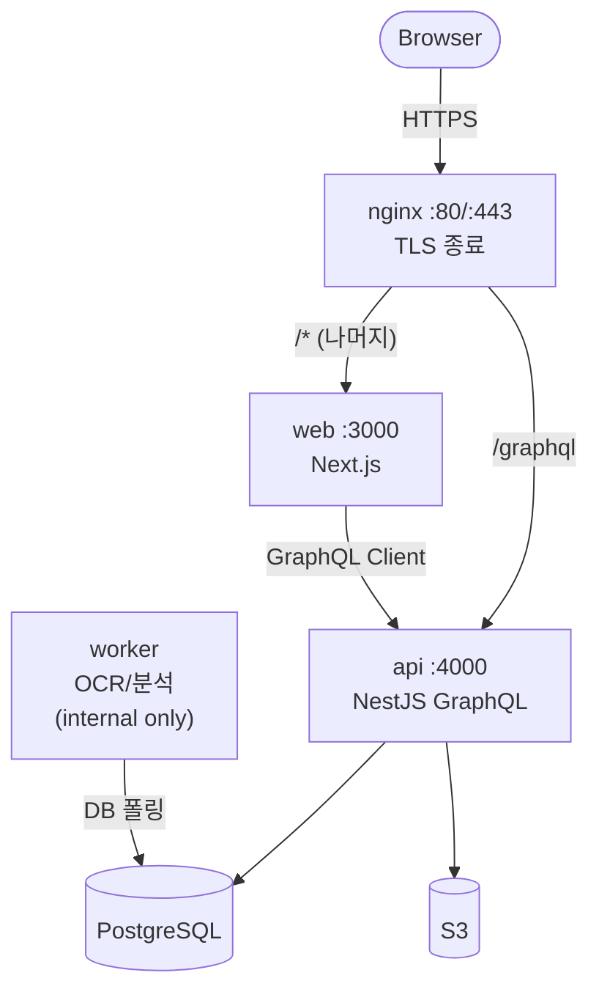
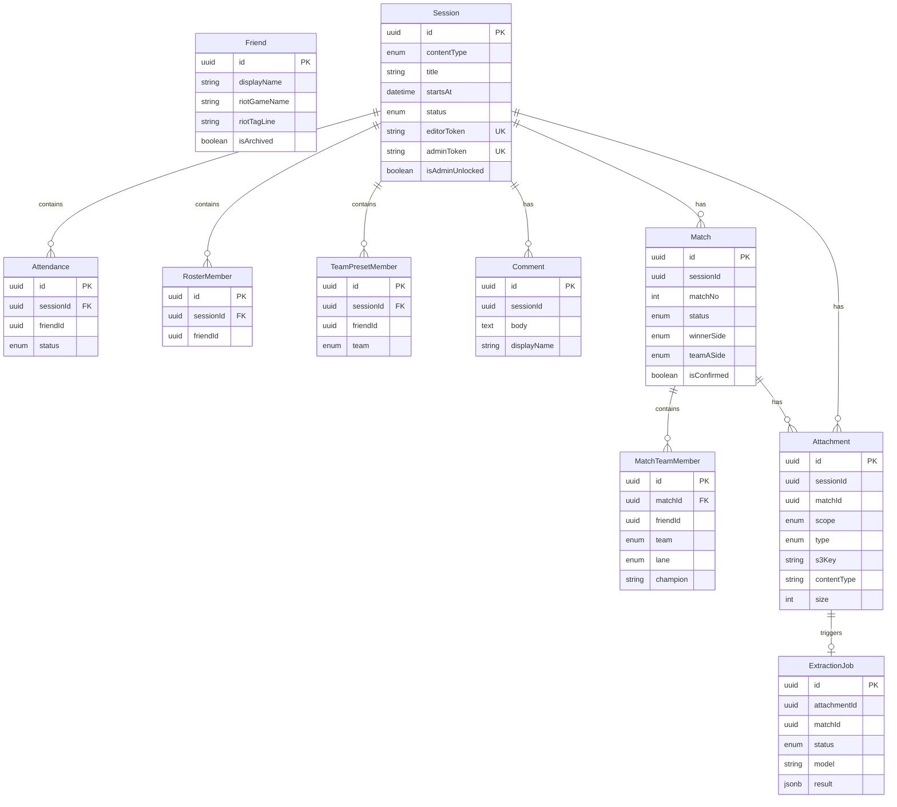

# PlayNote — System Design Spec (Concrete Draft v0.1)

> 이 문서는 “현재 확정된 스택(Next.js + NestJS GraphQL + PostgreSQL + MikroORM + S3 + EC2/Docker)”을 전제로, 구현 가능한 수준까지 시스템 설계를 구체화한 초안이다.  
> **아키텍처 최종 결정은 Cursor 설계 결과에 따라 변경 가능**하며, 변경 시 Decision Log에 기록한다.
>
> **문서 컨벤션**: 다이어그램은 **mermaid** 로 작성한다.

---

## 1) Goals / Non-Goals

### Goals

- 로그인 없이, **세션 링크(토큰)** 기반으로 모임을 운영한다.
- 세션(롤/풋살) 생성 → 참가/로스터 확정 → 팀 나누기 → 기록(댓글/첨부) 흐름 제공
- 롤은 세션 내 **Match 1..N** 지원 + 결과창 스샷 기반으로 승/패/진영 확정
- 확정된 Match만 대상으로 **승률/선호 라인/자주 이긴 챔피언 통계** 제공
- **댓글은 텍스트 전용**, 이미지는 별도 **Attachment(첨부)** 로 관리
- 세션당 첨부 이미지 총합 **최대 10장**
- 단톡방 1개 고정 → Friend는 **서비스 전역 단일 주소록**

### Non-Goals (MVP 범위 밖)

- 사용자 계정/로그인/프로필
- 여러 단톡방/그룹/멀티테넌시
- 롤 결과창 외의 스샷 포맷 지원
- 챔피언/라인 자동 추출 “필수화” (champion은 수동 입력 허용)
- 실시간 협업(OT, presence) 수준의 동시편집

---

## 2) High-Level Architecture

### 2.1 서비스 경계 / 컴포넌트 (확정)

- **Web (Next.js)** — 순수 프론트엔드
  - UI 렌더링 + 라우팅
  - GraphQL Client (API 서버와 통신)
  - 세션 토큰 저장/전송
  - S3 presigned URL로 직접 업로드 수행
  - BFF 없음: 서버 사이드 비즈니스 로직을 두지 않음
- **API (NestJS GraphQL)** — 모든 비즈니스 로직
  - DDD 4계층 구조 (Domain / Application / Infrastructure / Presentation)
  - GraphQL endpoint (Query / Mutation)
  - 토큰 검증 + AuthContext 주입 (Guard)
  - UseCase(Command/Query) 실행
  - S3 presigned URL 발급 + 첨부 제한(10장) 강제
  - OCR Job 생성(pending 상태로만 생성, 실행은 worker)
- **Worker** — OCR/분석 전용
  - OCR/분석 비동기 처리 (Attachment 기반)
  - 결과를 DB에 저장
  - 운영 방식 미정: 리서치 후 결정 (A. NestJS worker에서 Python CLI 호출 / B. 별도 Python 서비스)
- **PostgreSQL + MikroORM**
- **S3** — 첨부 파일 저장소
- **EC2 + Docker** — 컨테이너로 배포/운영

### 2.2 Deployment Topology (Single EC2 + Docker Compose)



- nginx: 80/443, TLS 종료 + 라우팅
- web (Next.js): :3000
- api (NestJS): :4000
- worker: 외부 요청 없음, DB 폴링
- postgres: 초기엔 docker, 안정화 시 RDS 고려
- (선택) redis: worker 큐용, MVP에서는 DB 폴링으로 충분

### 2.3 GraphQL 설계 (확정)

- **Code-First** 방식 (NestJS `@ObjectType`/`@InputType`/`@Field` 데코레이터, `autoSchemaFile` 자동 스키마 생성)
- **Relay 스펙 준수**: Global Object Identification, Input Object Mutations, Cursor Connections
- **GraphQL Client**: Apollo Client
- **Mutation 네이밍**: `{동사}{대상}` 형식, 비즈니스 의도 반영 (예: `confirmSession`, `lockRoster`, `createMatchFromPreset`)
- **에러 처리**: Exception 기반 (`BaseException` 상속), `errors[].extensions.code`로 에러 코드 전달
- **주 사용 환경**: 스마트폰 (카카오톡 링크 → 모바일 브라우저)

> 상세 규칙은 `NEW_DEVELOPMENT_GUIDE.md` 7절(프레젠테이션 계층), 11절(에러 처리) 참조

---

## 3) Authentication & Authorization (Token-based, 확정)

### Token Model

- Session 단위로 토큰 2개:
  - **editorToken**: 링크 가진 사람 (CRUD 대부분 가능)
  - **adminToken**: 운영 기능 가능 (unlock, token rotate 등)

### Token Transport (헤더 방식, 확정)

- 링크 진입: `/s/{sessionId}?t={token}` (카카오톡에서 공유)
- Web이 토큰을 localStorage에 저장:
  - key: `playnote:session:{sessionId}:token`
  - 세션별로 독립 저장 → 다중 세션 토큰 지원
- 이후 GraphQL 요청 시 **헤더**로 전송:
  - `x-session-id: <sessionId>`
  - `x-session-token: <token>`
- Apollo Client의 httpLink에서 헤더 자동 주입

> 쿠키 대신 헤더를 선택한 이유: 로그인 없는 세션별 토큰 모델에서 다중 세션 지원이 자연스럽고, CSRF 보호가 불필요하며, 모바일 브라우저 호환성이 우수함.

### Authorization Rules (MVP, 확정)

- **editor** (editorToken):
  - 세션/참여/로스터/팀/매치/댓글/첨부 생성·수정·삭제 가능
- **admin** (adminToken):
  - editor 권한 포함 + **unlock**, 강제 삭제/정리

> 설계 철학: 단톡방 내부 운영 도구이므로 권한을 과도하게 복잡하게 만들지 않는다.

### Token Rotation (MVP 스킵)

- editorToken 회전: 단톡방 전체 링크가 무효화되므로 **사용하지 않음**
- adminToken 재발급: MVP에서 불필요. 필요 시 나중에 추가 (Session 테이블 토큰 컬럼 값 업데이트)

### Abuse Mitigation (확정)

- **nginx `limit_req`**: IP 기반 ~30r/s (가장 단순, NestJS 코드 변경 없음)
- 업로드 제한: 세션당 10장 (비즈니스 룰)
- admin token은 공유하지 않는 운영 가이드(문서)
- NestJS ThrottlerModule 등은 MVP 불필요

---

## 4) Domain Model & State Machines

## 4.0 Aggregate / Bounded Context / 모듈 경계 (확정)

### Aggregate 설계

| Aggregate Root | 내부 Entity | Value Object | 비고 |
|---------------|-------------|-------------|------|
| **Friend** | — | RiotId, DisplayName | 전역 주소록, 단독 |
| **Session** | Attendance, RosterMember, TeamPresetMember | SessionStatus, SessionToken | 세션 생명주기 + 참가/로스터/팀 |
| **Comment** | — | — | 텍스트 전용, 단순 CRUD |
| **Match** | MatchTeamMember | MatchStatus, Side, Lane, WinnerSide | LoL 매치 생명주기 |
| **Attachment** | — | AttachmentType, AttachmentScope | 첨부 업로드/삭제 |
| **ExtractionJob** | — | ExtractionStatus | OCR 비동기 처리 |

> Content(LOL/FUTSAL)는 별도 Entity가 아니라 **Session의 enum 속성**으로 처리

### Bounded Context / NestJS 모듈 (확정)

| 모듈 | Aggregate Root(s) | Repository | 책임 |
|------|-------------------|------------|------|
| **`friend`** | Friend | IFriendRepository | 전역 주소록 CRUD + archive |
| **`session`** | Session, Comment | ISessionRepository, ICommentRepository | 세션 생명주기, 참가/로스터/팀, 댓글 |
| **`match`** | Match | IMatchRepository | LoL 매치 생명주기, 라인/챔피언, 결과 확정 |
| **`attachment`** | Attachment, ExtractionJob | IAttachmentRepository, IExtractionJobRepository | 첨부 업로드/삭제, S3 연동, OCR 파이프라인 |
| **`statistics`** | (없음, 읽기 전용) | — | 확정된 Match 기반 통계 쿼리 (ACL로 match/friend 데이터 조회) |

### Cross-Aggregate 연동 (UseCase 레벨)

| 시나리오 | 처리 방식 |
|---------|----------|
| Match 생성 시 TeamPreset 복사 | Match UseCase → Session ACL로 TeamPreset 조회 → MatchTeamMember 생성 |
| effectiveLocked 검사 | Session UseCase → Attachment ACL로 count 조회 |
| Attachment 업로드 시 10장 제한 | Attachment UseCase → 자체 Repository로 count 조회 |
| 통계 산출 | Statistics UseCase → Match/Friend ACL로 조회 |

### 폴더 구조 (educore 패턴)

```
src/domains/
├── friend/
│   ├── domain/
│   │   ├── aggregates/friend.aggregate.ts
│   │   ├── value-objects/riot-id.vo.ts
│   │   ├── repositories/friend.repository.interface.ts
│   │   ├── exceptions/
│   │   └── constants.ts
│   ├── application/
│   ├── infrastructure/
│   ├── presentation/
│   └── friend.module.ts
├── session/
│   ├── domain/
│   │   ├── aggregates/session.aggregate.ts
│   │   ├── aggregates/comment.aggregate.ts
│   │   ├── entities/attendance.entity.ts
│   │   ├── entities/roster-member.entity.ts
│   │   ├── entities/team-preset-member.entity.ts
│   │   ├── enums/session-status.enum.ts
│   │   ├── enums/attendance-status.enum.ts
│   │   ├── enums/team.enum.ts
│   │   ├── enums/content-type.enum.ts
│   │   ├── value-objects/session-token.vo.ts
│   │   ├── repositories/session.repository.interface.ts
│   │   ├── repositories/comment.repository.interface.ts
│   │   └── constants.ts
│   ├── application/
│   ├── infrastructure/
│   ├── presentation/
│   └── session.module.ts
├── match/
│   ├── domain/
│   │   ├── aggregates/match.aggregate.ts
│   │   ├── entities/match-team-member.entity.ts
│   │   ├── enums/match-status.enum.ts
│   │   ├── enums/side.enum.ts
│   │   ├── enums/lane.enum.ts
│   │   ├── repositories/match.repository.interface.ts
│   │   └── constants.ts
│   ├── application/
│   ├── infrastructure/
│   ├── presentation/
│   └── match.module.ts
├── attachment/
│   ├── domain/
│   │   ├── aggregates/attachment.aggregate.ts
│   │   ├── aggregates/extraction-job.aggregate.ts
│   │   ├── enums/attachment-type.enum.ts
│   │   ├── enums/attachment-scope.enum.ts
│   │   ├── enums/extraction-status.enum.ts
│   │   ├── repositories/attachment.repository.interface.ts
│   │   ├── repositories/extraction-job.repository.interface.ts
│   │   └── constants.ts
│   ├── application/
│   ├── infrastructure/
│   ├── presentation/
│   └── attachment.module.ts
└── statistics/
    ├── application/
    │   └── use-cases/queries/
    ├── presentation/
    └── statistics.module.ts
```

## 4.1 Core Entities (Conceptual)

- Friend (전역 주소록)
- Content (LOL / FUTSAL) — Session의 enum 속성
- Session (single startsAt)
- Attendance (Session 내부 Entity)
- RosterMember (Session 내부 Entity)
- TeamPresetMember (Session 내부 Entity)
- Match (LOL only, session 내 1..N)
- MatchTeamMember (Match 내부 Entity)
- Comment (text-only, session 모듈에 공존)
- Attachment (session or match scope)
- ExtractionJob (OCR/분석 결과)

## 4.2 Session State

- `scheduled` : 세션 생성됨, 참가 상태 수집
- `confirmed` : 진행 확정(Confirm)
- `roster_locked` : 참가자 확정(Lock roster)
- `done` : 운영상 마감(옵션)

### Allowed Operations by Session Status

- scheduled:
  - attendance 변경 가능
  - confirm 가능
- confirmed:
  - attendance 변경 가능
  - roster_lock 가능
- roster_locked:
  - roster 확정 상태 (단, **attachment 0장일 때 변경 가능** 정책 적용)
  - 팀 프리셋 설정 가능(attachment 0장일 때)
  - (LOL) match 생성/라인/챔피언 설정 가능(attachment 0장일 때)

## 4.3 Locking Rule (확정)

### Lock Computation

- Session 테이블에 `isAdminUnlocked: boolean` (default: false) 컬럼
- `sessionAttachmentCount`: 세션에 속한 모든 Attachment 수 (SESSION + MATCH scope 합산)
- **`effectiveLocked = (sessionAttachmentCount > 0) && !isAdminUnlocked`**
- Attachment 전부 삭제하여 count = 0이 되면 **자동 해제** (공식에 의해 자연스럽게 동작)

### Locked State ACL (확정)

| 액션 | unlocked | locked | admin unlock 후 |
|------|:---:|:---:|:---:|
| roster 변경 (추가/제거) | O | **X** | O |
| SessionTeamPreset 변경 (A/B 배정) | O | **X** | O |
| MatchTeamMember 변경 (팀/라인/챔피언) | O | **X** | O |
| Match 생성 (createMatchFromPreset) | O | **X** | O |
| 댓글 작성/삭제 | O | O | O |
| 첨부 업로드 | O | O | O |
| 첨부 삭제 | O | O | O |
| Match 결과 확정 (confirmMatchResult) | O | O | O |
| Session 상태 전이 (confirm/lockRoster/done) | O | O | O |

> 원칙: **잠김은 "구조 변경"만 막고, "기록 추가"와 "결과 확정"은 항상 허용**

### Unlock Policy (확정)

- `adminUnlock(sessionId)`: `isAdminUnlocked = true`로 설정
- `adminRelock(sessionId)`: 선택 사항 (필요 시 제공, `isAdminUnlocked = false`)

---

## 4.4 Data Model (확정)

### ERD



### Entity 필드 상세

**Friend**

| 필드 | 타입 | 제약 | 비고 |
|------|------|------|------|
| id | UUID v7 | PK | |
| displayName | string | NOT NULL | 그룹에서 부르는 이름 |
| riotGameName | string | nullable | Riot ID (gameName), OCR 매칭용 |
| riotTagLine | string | nullable | Riot ID (tagLine), OCR 매칭용 |
| isArchived | boolean | default false | 삭제 대신 아카이브 |
| createdAt | DateTime | NOT NULL | |
| updatedAt | DateTime | NOT NULL | |

**Session**

| 필드 | 타입 | 제약 | 비고 |
|------|------|------|------|
| id | UUID v7 | PK | |
| contentType | enum | NOT NULL | LOL / FUTSAL |
| title | string | nullable | 선택적 제목 |
| startsAt | DateTime | NOT NULL | 세션 날짜/시간 |
| status | enum | NOT NULL, default SCHEDULED | SCHEDULED / CONFIRMED / ROSTER_LOCKED / DONE |
| editorToken | string | NOT NULL, UNIQUE | 링크 공유용 |
| adminToken | string | NOT NULL, UNIQUE | 운영자용 |
| isAdminUnlocked | boolean | default false | 잠금 해제 플래그 |
| createdAt | DateTime | NOT NULL | |
| updatedAt | DateTime | NOT NULL | |

**Attendance** (Session 내부)

| 필드 | 타입 | 제약 | 비고 |
|------|------|------|------|
| id | UUID v7 | PK | |
| sessionId | UUID | NOT NULL, FK | |
| friendId | UUID | NOT NULL | |
| status | enum | NOT NULL | YES / NO / MAYBE |
| createdAt | DateTime | NOT NULL | |
| updatedAt | DateTime | NOT NULL | |
| | | UNIQUE(sessionId, friendId) | |

**RosterMember** (Session 내부)

| 필드 | 타입 | 제약 | 비고 |
|------|------|------|------|
| id | UUID v7 | PK | |
| sessionId | UUID | NOT NULL, FK | |
| friendId | UUID | NOT NULL | |
| createdAt | DateTime | NOT NULL | |
| | | UNIQUE(sessionId, friendId) | |

**TeamPresetMember** (Session 내부)

| 필드 | 타입 | 제약 | 비고 |
|------|------|------|------|
| id | UUID v7 | PK | |
| sessionId | UUID | NOT NULL, FK | |
| friendId | UUID | NOT NULL | |
| team | enum | NOT NULL | A / B |
| createdAt | DateTime | NOT NULL | |
| updatedAt | DateTime | NOT NULL | |
| | | UNIQUE(sessionId, friendId) | |

**Comment**

| 필드 | 타입 | 제약 | 비고 |
|------|------|------|------|
| id | UUID v7 | PK | |
| sessionId | UUID | NOT NULL | Session ID 참조 |
| body | text | NOT NULL | |
| displayName | string | nullable | 익명 or 이름 선택 |
| createdAt | DateTime | NOT NULL | |
| | | INDEX(sessionId) | |

**Match**

| 필드 | 타입 | 제약 | 비고 |
|------|------|------|------|
| id | UUID v7 | PK | |
| sessionId | UUID | NOT NULL | Session ID 참조 |
| matchNo | integer | NOT NULL | 세션 내 순번 (1-based) |
| status | enum | NOT NULL, default DRAFT | DRAFT / LINEUP_LOCKED / COMPLETED |
| winnerSide | enum | NOT NULL, default UNKNOWN | BLUE / RED / UNKNOWN |
| teamASide | enum | NOT NULL, default UNKNOWN | BLUE / RED / UNKNOWN |
| isConfirmed | boolean | default false | 통계 반영 여부 |
| createdAt | DateTime | NOT NULL | |
| updatedAt | DateTime | NOT NULL | |
| | | UNIQUE(sessionId, matchNo) | |

**MatchTeamMember** (Match 내부)

| 필드 | 타입 | 제약 | 비고 |
|------|------|------|------|
| id | UUID v7 | PK | |
| matchId | UUID | NOT NULL, FK | |
| friendId | UUID | NOT NULL | |
| team | enum | NOT NULL | A / B |
| lane | enum | NOT NULL, default UNKNOWN | TOP / JG / MID / ADC / SUP / UNKNOWN |
| champion | string | nullable | 수동 입력 |
| createdAt | DateTime | NOT NULL | |
| updatedAt | DateTime | NOT NULL | |
| | | UNIQUE(matchId, friendId) | |

**Attachment**

| 필드 | 타입 | 제약 | 비고 |
|------|------|------|------|
| id | UUID v7 | PK | |
| sessionId | UUID | NOT NULL | Session ID 참조 |
| matchId | UUID | nullable | Match ID (SESSION scope면 null) |
| scope | enum | NOT NULL | SESSION / MATCH |
| type | enum | NOT NULL | FUTSAL_PHOTO / LOL_RESULT_SCREEN |
| s3Key | string | NOT NULL | S3 객체 키 |
| contentType | string | NOT NULL | MIME type |
| size | integer | NOT NULL | bytes |
| width | integer | nullable | |
| height | integer | nullable | |
| originalFileName | string | nullable | |
| createdAt | DateTime | NOT NULL | |
| | | INDEX(sessionId) | count 쿼리 + 목록 조회 |

**ExtractionJob**

| 필드 | 타입 | 제약 | 비고 |
|------|------|------|------|
| id | UUID v7 | PK | |
| attachmentId | UUID | NOT NULL | Attachment ID 참조 |
| matchId | UUID | NOT NULL | Match ID 참조 |
| status | enum | NOT NULL, default PENDING | PENDING / RUNNING / DONE / FAILED |
| model | string | nullable | 모델 버전 |
| result | jsonb | nullable | 추출 결과 (done 시) |
| errorMessage | string | nullable | 실패 사유 (failed 시) |
| startedAt | DateTime | nullable | |
| completedAt | DateTime | nullable | |
| createdAt | DateTime | NOT NULL | |
| updatedAt | DateTime | NOT NULL | |
| | | INDEX(status) | worker 폴링용 |

### 세션당 10장 제한 강제 방식

1. **Presign 단계**: UseCase에서 `SELECT COUNT(*) FROM attachment WHERE sessionId = ?` 확인
2. **Complete 단계**: 트랜잭션 내에서 재확인 — `COUNT(*) ... FOR UPDATE` + count >= 10이면 reject
3. **동시성**: FOR UPDATE + 트랜잭션으로 race condition 방지

### 통계 산출에 필요한 최소 필드 (이미 포함 확인)

| 지표 | 사용 필드 |
|------|----------|
| Friend 승률 | MatchTeamMember(friendId, team) + Match(winnerSide, teamASide, isConfirmed) |
| 선호 라인 | MatchTeamMember(friendId, lane) |
| 자주 이긴 챔피언 | MatchTeamMember(friendId, champion, team) + Match(winnerSide, teamASide) |

> 승/패 계산: `teamAWon = (winnerSide === teamASide)`, `memberWon = (member.team === A && teamAWon) || (member.team === B && !teamAWon)`

---

## 5) Attachment & S3 Upload Design

### Constraints

- 세션당 첨부 총합 <= **10**
- 댓글에 이미지 첨부 불가
- 첨부는 2종:
  - FUTSAL_PHOTO (session scope)
  - LOL_RESULT_SCREEN (match scope)

### Presigned Upload Flow (Recommended)

1. Web → GraphQL `createPresignedUpload(input)` 호출

- input: `{ sessionId, scope(SESSION|MATCH), matchId?, type, contentType, fileName? }`

2. API:

- token 권한 검증(editor 이상)
- 세션의 attachment count 확인
- 10장 이상이면 reject
- S3 presigned URL 생성
- uploadId(서버 추적용) 반환

3. Web:

- presigned URL로 S3 직접 업로드

4. Web → GraphQL `completeUpload(input)` 호출

- input: `{ uploadId, sessionId, matchId?, s3Key, size, contentType, width?, height? }`

5. API:

- 다시 count 확인(레이스 컨디션 방지)
- Attachment row 생성
- 세션 attachmentCount 갱신(선택)
- LOL_RESULT_SCREEN이면 ExtractionJob 생성

### Delete Attachment

- GraphQL `deleteAttachment(id)`
- API:
  - 권한(editor/admin) 확인
  - DB row delete + S3 object delete(비동기 가능)
  - count 갱신
  - count가 0이면 lock 해제 여부 정책 반영

---

## 6) LoL Match Model (Session contains Match 1..N)

### Key Requirements

- 세션에서 만든 Team A/B 프리셋을 match 생성 시 복사
- match마다 blue/red 진영이 바뀜
- 진영/승패 관련 값은 **결과창 스샷** 기준으로 확정

### Team vs Side Separation

- Team A/B: 사람팀 (preset 및 match lineup)
- Side blue/red: 게임 진영
- Match fields:
  - `winnerSide`: blue|red|unknown
  - `teamA_side`: blue|red|unknown (A가 어떤 진영인지)
- 승/패 계산:
  - teamA_side + winnerSide로 Team A/B 승패 도출 가능

### Match Lifecycle

- `draft` : 생성됨, 라인/챔피언 입력 전
- `lineup_locked` : (선택) “이 판 라인 확정” 같은 운영 플래그
- `completed` : 결과 확정됨
- `isConfirmed` : 통계 반영 여부 (결과 확정 시 true)

### Match Creation (from preset)

- Mutation: `createMatchFromPreset(sessionId)`
  - new matchNo = max+1
  - SessionTeamPreset(A/B) 복사 → MatchTeamMember 생성
  - winnerSide/teamA_side = unknown 초기화

### Lane Selection

- roster_locked + (effectiveLocked=false) 상태에서만 변경 허용
- lane enum: top/jg/mid/adc/sup/unknown

### Champion Input

- 수동 입력 허용
- 최소: string 저장 (나중에 championId 매핑 가능)

---

## 7) OCR / Extraction Pipeline (LoL Result Screen Only)

### Input Constraints (MVP Fixed)

- 롤 첨부는 **게임 종료 결과창 1종**만 지원
- 업로드 파일 type: LOL_RESULT_SCREEN

### Job Model

- ExtractionJob:
  - `status`: pending|running|done|failed
  - `model`: string (ex. "tesseract-v1", "gpt-vision-vX", etc.)
  - `result`: jsonb
    - 최소 스키마:
      - `winnerSide`: blue|red|unknown
      - `teamA_side`: blue|red|unknown
      - `confidence`: number?
      - `notes`: string?
      - `raw`: (optional) raw text/boxes

### Execution

- completeUpload에서 LOL_RESULT_SCREEN이면 job 생성(pending)
- worker가 pending job을 pick → running → done/failed 업데이트

### Confirm UX & Source of Truth

- 자동 추출 결과는 “초안”
- 최종 확정은 Mutation `confirmMatchResult(matchId, input)`
  - input: `{ winnerSide, teamA_side }` (+ optional sourceAttachmentId)
- confirm 시:
  - Match.winnerSide / Match.teamA_side 업데이트
  - Match.isConfirmed = true
  - Match.status = completed

> 자동 추출이 실패해도 수동 확정 가능해야 하며, 집계는 isConfirmed=true만 사용한다.

---

## 8) Comments (Text-only Community)

### Requirements

- 텍스트만 허용
- editor/admin 모두 삭제 가능

### Model

- Comment:
  - sessionId
  - body (text)
  - displayName? (옵션)
  - createdAt

### Moderation (MVP)

- delete only
- admin token으로 bulk delete 등은 v1+

---

## 9) Friend (Global Address Book)

### Requirements

- 단톡방 1개 고정 → 전역 Friend 목록 1개
- 통계 집계의 기준 단위
- 삭제 대신 archive 권장

### Matching Strategy (Future)

- OCR에서 닉네임을 읽을 수 있다면 Friend.aliases/riotId로 매핑 시도
- 애매하면 UI에서 선택(수동 매핑) 후 aliases에 추가

---

## 10) Statistics (Must-have)

### Scope

- 확정된 LoL Match (Match.isConfirmed=true)만 사용

### Metrics

- Friend winrate
- Preferred lane distribution
- Most-won champions

### Query Strategy (MVP)

- on-demand aggregation via SQL/group-by
- 성능 문제 시 캐시 테이블(FriendStats) 도입 가능

### Suggested GraphQL

- `statsLOL(input: { range?, friendId? }): StatsView`
  - default: 전체 기간
  - optional: 기간 필터

---

## 11) GraphQL API Surface (Outline)

### Queries

- `session(sessionId): SessionView`
  - includes: content, attendance, roster, teamPreset, matches summary, attachments summary, comments
- `friends(query, includeArchived=false): [Friend]`
- `match(matchId): MatchView`
- `statsLOL(range?, friendId?): StatsView`

### Mutations (Core)

- Session
  - `createSession(input)`
  - `confirmSession(sessionId)`
  - `lockRoster(sessionId)`
  - `markDone(sessionId)` (optional)
  - `adminUnlock(sessionId)` (admin)
- Attendance / Roster
  - `setAttendance(sessionId, friendId, status)`
  - `setRosterConfirmed(sessionId, friendIds[])` (or incremental)
- Friends
  - `createFriend(input)`
  - `updateFriend(id, patch)`
  - `archiveFriend(id)`
- TeamPreset (session-level A/B)
  - `setTeamMember(sessionId, friendId, team)`
  - `bulkSetTeams(sessionId, assignments[])`
- LoL Match
  - `createMatchFromPreset(sessionId)`
  - `setLane(matchId, friendId, lane)`
  - `setChampion(matchId, friendId, champion)`
  - `confirmMatchResult(matchId, input)` // winnerSide + teamA_side
- Attachments
  - `createPresignedUpload(input)`
  - `completeUpload(input)`
  - `deleteAttachment(id)`
- Comments
  - `createComment(sessionId, body, displayName?)`
  - `deleteComment(id)`

### Subscription (Not MVP)

- 실시간 갱신 필요 시 추후 검토

---

## 12) Data Integrity & Concurrency

### Attachment 10장 제한 (Race Condition)

- presign 단계에서 count 체크
- complete 단계에서 재체크 + 트랜잭션
- DB 레벨에서도 보강 가능:
  - `SELECT COUNT(*) ... FOR UPDATE`로 session row lock 후 insert
  - 또는 session.attachmentCount 컬럼을 atomic increment로 관리

### MatchNo assignment

- `max(matchNo)+1` 계산 시 동시성 고려
  - sessionId에 대한 lock 또는 unique constraint + retry

### Locked state enforcement

- 모든 mutation에서 `effectiveLocked` 검사 후 허용/거절
- admin token은 unlock 수행 후 변경 가능

---

## 13) Observability (Recommended Minimum)

- API:
  - request log (sessionId, operationName, latency, result)
  - error log (stack + correlation id)
- Worker:
  - job status transition logs
  - failed job reason
- Metrics:
  - attachment uploads count
  - extraction success rate
- Tracing(선택): OpenTelemetry

---

## 14) Deployment & Configuration

### Docker Images

- web: Next.js production build
- api: Nest build
- worker: Node build (Nest microservice or lightweight runner)

### Environment Variables (Examples)

- DATABASE_URL
- S3_BUCKET, AWS_REGION
- AWS_ACCESS_KEY_ID, AWS_SECRET_ACCESS_KEY (또는 IAM role)
- PUBLIC_BASE_URL
- GRAPHQL_ENDPOINT (web)
- (선택) REDIS_URL
- (선택) OCR_MODEL_CONFIG

### Network

- nginx: 80/443
- web/api/worker: internal docker network
- postgres: internal only

---

## 15) Open Questions (to be decided with Cursor)

- Worker 큐 방식: DB polling vs Redis/BullMQ
- GraphQL style: code-first vs schema-first
- Attachment 삭제로 0장이 되면 lock 자동 해제할지 여부
- admin token rotate 정책(필수 여부)
- OCR 모델 후보/성능 기준, fallback UX 상세

---

## 16) Decision Log (Template)

- [2026-02-28] 결정: 서비스 경계 확정 (2.1)
  - Web(Next.js) = 순수 프론트, BFF 없음
  - API(NestJS) = 모든 비즈니스 로직 + GraphQL + 토큰 검증 + presigned URL
  - Worker = OCR 전용, 운영 방식은 리서치 후 결정
  - Nginx = `/graphql` → api, `/*` → web, TLS 종료
  - 이유: MVP 단계에서 인프라 복잡도 최소화, 단일 EC2로 충분
  - 대안: BFF 패턴(Next API Routes) — 불필요한 계층 추가이므로 제외
  - 영향: 프론트는 GraphQL Client로만 API 통신
  - TODO: Worker 운영 방식 리서치 (Python CLI vs 별도 서비스)

- [2026-02-28] 결정: GraphQL 설계 확정 (2.2)
  - Code-First 방식 (educore-platform-be 패턴, NEW_DEVELOPMENT_GUIDE.md 준수)
  - GraphQL Client: Apollo Client
  - Mutation 네이밍: `{동사}{대상}` 형식 (비즈니스 의도 반영)
  - Auth context: 헤더 방식 (`x-session-id` + `x-session-token`)
  - 이유: Code-First는 educore best practice와 동일 패턴 활용 가능. 헤더는 로그인 없는 다중 세션 토큰 모델에 자연스러움
  - 대안: Schema-First — educore 패턴 재활용 불가, 쿠키 — 다중 세션 토큰 구분 어려움 + CSRF 보호 필요
  - 영향: Presentation 계층은 NEW_DEVELOPMENT_GUIDE.md 7절 규칙 그대로 적용
  - 참고: 주 사용 환경은 스마트폰 (카카오톡 링크 → 모바일 브라우저)

- [2026-02-28] 결정: 권한/보안 확정 (2.3)
  - 토큰 저장: localStorage (`playnote:session:{sessionId}:token`)
  - 토큰 회전: MVP 스킵 (editorToken 회전은 모든 링크 무효화, adminToken은 위험도 낮음)
  - Rate limiting: nginx `limit_req` IP 기반 ~30r/s만 적용
  - 이유: 단톡방 내부 도구로 위협 수준 낮음, 과도한 보안 장치는 복잡도만 증가
  - 대안: NestJS ThrottlerModule — MVP에서 과함, 토큰 회전 — editorToken은 혼란 유발
  - 영향: Guard는 토큰 검증만 담당 (editor/admin 구분), 별도 회전 로직 불필요

- [2026-02-28] 결정: 도메인/상태 머신 — 잠김 규칙 확정 (2.4)
  - 잠김 계산: `effectiveLocked = (attachmentCount > 0) && !isAdminUnlocked`
  - Session에 `isAdminUnlocked: boolean` 컬럼 추가
  - 잠김 ACL: 구조 변경(roster/teamPreset/matchTeamMember/match생성)만 잠금, 기록/결과 확정은 항상 허용
  - 0장 시 자동 해제 (공식에 의해 자연스럽게 동작)
  - 이유: admin이 첨부 유지하면서 라인 수정 등 가능해야 하므로 별도 unlock 플래그 필요
  - 대안: unlock 없이 첨부 삭제→수정→재업로드 — UX 불편

- [2026-02-28] 결정: Aggregate / BC / 모듈 경계 확정 (2.4.1)
  - Aggregate Root 6개: Friend, Session, Comment, Match, Attachment, ExtractionJob
  - Session 내부 Entity: Attendance, RosterMember, TeamPresetMember (순차적 의존 관계, 불변식 검증)
  - Match 내부 Entity: MatchTeamMember
  - BC/모듈 5개: friend, session(+Comment), match, attachment(+ExtractionJob), statistics(읽기 전용)
  - Content(LOL/FUTSAL)는 별도 Entity가 아니라 Session의 enum 속성
  - 이유: Aggregate별 독립 생명주기 존중, 트랜잭션 경계 명확화, cross-aggregate는 ACL로 연동
  - 대안: Session에 Match/Attachment 포함 — Aggregate 비대화, 불필요한 로드

- [2026-02-28] 결정: 데이터 모델 확정 (2.5)
  - 11개 테이블 ERD 확정 (mermaid)
  - Friend: aliases 제거, riotGameName/riotTagLine이 OCR 매칭 필드
  - 10장 제한: presign count 확인 + complete 트랜잭션 내 FOR UPDATE 재확인
  - 통계 최소 필드: 이미 설계에 모두 포함 (추가 필드 불필요)
